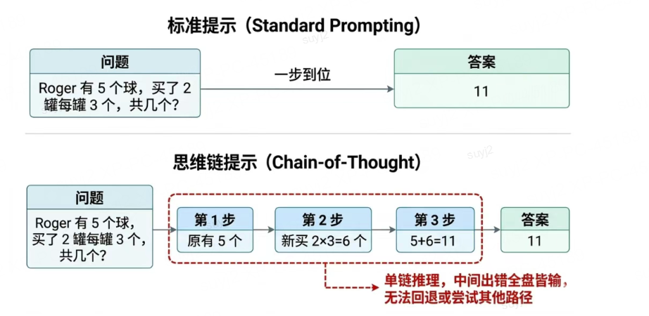

# 思维链（CoT）：让模型"慢慢想，一步步来"

## 一句话结论

思维链（Chain-of-Thought, CoT）是让模型显式写出中间推理步骤的提示技术，由Google在2022年提出，通过"把思考过程说出来"大幅提升复杂推理任务的效果，但本质是单条链路、不可回退的线性推理。

## 图例


---

## 1. Why：背景与痛点

### 1.1 业务背景
- **直接回答不够用**：简单问题没问题，复杂推理（数学题、逻辑题）经常出错
- **需要可解释性**：直接给答案，用户不知道模型"怎么想的"，难以信任
- **错误难以定位**：不知道哪一步错了，调试困难

### 1.2 技术背景
- **Standard Prompting**：直接输入→直接输出，模型在一次前向传播中完成所有计算
- **Google 2022论文**：正式提出CoT，揭示了"显式推理"的威力
- **不是教模型推理**：大模型内部已有推理能力，CoT只是把这个能力"激活"了

### 1.3 约束与目标
| 维度 | 目标 | 约束 |
|------|------|------|
| **准确率** | 显著提升复杂任务 | 推理过程更长，Token更多 |
| **可解释性** | 可见每一步推理 | - |
| **成本** | 可接受 | 比直接回答Token多 |
| **延迟** | 可接受 | 比直接回答略长 |

---

## 2. What：概念与边界

### 2.1 核心定义
**思维链（CoT）**：让模型在回答问题时，显式地写出中间推理步骤，而非直接输出答案。每一步中间结果都是下一步推理的"垫脚石"。

### 2.2 示例对比

**Standard Prompting（直接回答）**：
```
问：Roger有5个网球，又买了2罐，每罐3个，他现在有多少个？
答：11
```

**CoT Prompting（显式推理）**：
```
问：Roger有5个网球，又买了2罐，每罐3个，他现在有多少个？
答：Roger一开始有5个球，2罐每罐3个就是6个，5 + 6 = 11
```

### 2.3 术语对齐
| 术语 | 说明 |
|------|------|
| **思维链 (CoT)** | 显式写出中间推理步骤的提示方法 |
| **Standard Prompting** | 直接输入→直接输出，无中间步骤 |
| **Few-shot CoT** | 提供带推理过程的示例 |
| **Zero-shot CoT** | 加一句"让我们一步步思考" |

### 2.4 系统边界
- **输入**：问题 + CoT触发指令/示例
- **输出**：推理步骤 + 最终答案
- **局限**：单条链路、线性、不可回退

---

## 3. How：原理与实践

### 3.1 原理：为什么CoT能行？

**结论句**：CoT通过把复杂问题拆解成多个简单步骤，让每一步都变成模型擅长的"小任务"，大幅降低推理难度。

#### 关键机制
1. **问题拆解**：把复杂问题拆成多个简单子问题
2. **中间结果锚定**：每一步结果都是下一步的"锚点"，防止偏离
3. **推理能力激活**：大模型内部有推理能力，CoT只是"引导"它用出来

#### 前提假设
- 模型足够大（通常 10B+ 参数，小模型效果不明显）
- 问题需要多步推理（简单问题用不用CoT差别不大）
- 模型有能力理解和执行分步推理

#### 复杂度分析
| 维度 | 分析 |
|------|------|
| **推理步骤数** | O(问题复杂度) |
| **Token消耗** | 比直接回答多 2~5 倍 |
| **准确率** | 复杂任务提升 20%~50% |

---

### 3.2 触发方式：Zero-shot vs Few-shot

#### 方式1：Zero-shot CoT（零样本思维链）
最简单粗暴，加一句"让我们一步步思考"（或英文"Let's think step by step"）。

**示例**：
```markdown
问：小明有10块糖，给了小红3块，又买了5块，现在有多少块？
让我们一步步思考。
```

**优点**：
- 最简单，无需写示例
- 适用范围广

**缺点**：
- 效果不如Few-shot稳定
- 推理格式可能不统一

---

#### 方式2：Few-shot CoT（少样本思维链）
在Prompt中提供几个带推理过程的示例，让模型"模仿"。

**示例**：
```markdown
示例1：
问：Roger有5个网球，又买了2罐，每罐3个，他现在有多少个？
答：Roger一开始有5个球，2罐每罐3个就是6个，5 + 6 = 11

示例2：
问：一个笼子里有鸡和兔子，共10个头，28只脚，鸡和兔子各几只？
答：假设全是鸡，应该有20只脚，多了8只脚，每只兔子比鸡多2只脚，所以有4只兔子，6只鸡。

新问题：
...
```

**优点**：
- 效果更稳定
- 可以控制推理格式

**缺点**：
- 需要写示例
- Prompt更长

---

### 3.3 架构拆解

```
┌─────────────────────────────────────────────────┐
│           CoT Prompt 构造层                      │
│  ┌─────────────┐  ┌─────────────┐             │
│  │  问题        │→ │  CoT触发器   │             │
│  └─────────────┘  └─────────────┘             │
│              (Zero-shot / Few-shot)             │
└─────────────────────────────────────────────────┘
                    ↓
┌─────────────────────────────────────────────────┐
│              LLM 推理层                          │
│  ┌──────────┐  ┌──────────┐  ┌──────────┐   │
│  │ 步骤1    │→ │ 步骤2    │→ │ ...      │→ │ 答案 │
│  └──────────┘  └──────────┘  └──────────┘   │
│         (单条链路，不可回退)                     │
└─────────────────────────────────────────────────┘
```

---

### 3.4 技术选型：Standard vs Zero-shot-CoT vs Few-shot-CoT

| 维度 | Standard | Zero-shot-CoT | Few-shot-CoT |
|------|----------|---------------|--------------|
| **示例数** | 0 | 0 | 1~5 |
| **优点** | • 最快<br>• Token最少 | • 简单<br>• 比Standard好 | • 效果最好<br>• 可控 |
| **缺点** | • 复杂任务差<br>• 不可解释 | • 效果不够稳定<br>• 格式不统一 | • 需要写示例<br>• Prompt长 |
| **成本** | 最低 | 低 | 中等 |
| **适用** | 简单问题 | 中等复杂度 | 复杂任务 |

**选择依据**：
- 简单问题 → Standard
- 想试试效果 → Zero-shot-CoT
- 生产环境、效果要求高 → Few-shot-CoT

---

### 3.5 实现要点：写出高质量CoT

#### 要点1：Zero-shot-CoT的触发词
```
✅ 推荐：
"让我们一步步思考"
"Let's think step by step"
"请详细描述你的推理过程"
```

#### 要点2：Few-shot-CoT的示例要一致
```
✅ 好的示例：
所有示例用同样的推理风格
所有示例用同样的格式
示例覆盖不同情况
```

#### 要点3：可以要求模型"先思考，再回答"
```markdown
请先写出你的推理过程，然后给出最终答案。
答案格式：最终答案：XXX
```

---

## 4. 优缺点与局限

### 4.1 优点

| 优点 | 说明 |
|------|------|
| **效果提升显著** | 复杂推理任务准确率提升 20%~50% |
| **可解释性强** | 能看到每一步推理，更容易信任 |
| **调试方便** | 知道哪一步错了，便于修复 |
| **实现简单** | 不需要改模型，只用改Prompt |

---

### 4.2 本质局限（重要！）

**结论句**：CoT是单条链路、线性、不可回退的——中间一步错，后面全错。

#### 局限1：单条链路
- 只有一条推理路径，没有"换条路试试"的机制
- 一旦走错，无法回头

#### 局限2：线性推理
- 从第一步到最后一步，顺序执行
- 不能"跳步"或"回头检查"

#### 局限3：错误传播
- 中间某一步错了，后面所有步骤都会跟着错
- 没有"纠错"机制

---

## 5. 适用场景分析

### 5.1 推荐使用场景

| 场景类型 | 具体例子 | 为什么适合 |
|---------|---------|-----------|
| **数学推理** | 应用题、逻辑题 | 需要多步计算 |
| **代码理解** | 解释代码、找bug | 需要逐步分析 |
| **复杂决策** | 多条件判断、因果分析 | 需要清晰的推理链 |
| **教学场景** | 辅导作业、讲解题目 | 需要展示思考过程 |

---

### 5.2 不推荐使用场景

| 场景类型 | 具体例子 | 为什么不适合 |
|---------|---------|-------------|
| **简单问题** | 二选一分类、简单摘要 | 杀鸡用牛刀，Standard够用 |
| **需要探索多条路径** | 复杂规划、问题求解 | CoT只有单条路，需要ToT/GoT |
| **Token极端敏感** | 边缘设备、超低延迟 | CoT推理过程长，Token多 |
| **不需要可解释性** | 内部处理、不重要场景 | 直接回答更快更省 |

---

## 6. 智能座舱场景落地示例

### 场景：座舱故障诊断CoT辅助

**映射到 Why**：
- 痛点：直接给"故障原因"，用户不信任，也不知道怎么排查
- 目标：让诊断过程透明，每一步都有依据

**映射到 What**：
- 输入：故障现象
- 输出：推理步骤 + 故障原因 + 建议

**映射到 How**：

#### Prompt 设计
```markdown
你是智能座舱的专业故障诊断助手。
请一步步分析故障原因，然后给出建议。

用户反馈："中控屏幕黑屏了"

让我们一步步思考。
```

#### 推理过程示例
```
1. 首先检查电源：中控黑屏最常见的原因是电源问题
2. 检查车机是否启动：如果车机没启动，屏幕自然不亮
3. 检查屏幕亮度：可能是亮度调到最低了
4. 检查连接：屏幕和主机的连接线是否松动
5. 初步判断：先让用户重启车机试试
```

---

## 7. 面试官追问清单

### Q1：CoT为什么能提升效果？原理是什么？
**回答要点**：
- 把复杂问题拆成多个简单步骤
- 每一步都是模型擅长的"小任务"
- 中间结果"锚定"下一步，防止偏离
- 不是"教"模型推理，而是"激活"它已有的能力
- 小模型效果不明显，大模型才有用

### Q2：Zero-shot-CoT和Few-shot-CoT怎么选？
**回答要点**：
- Zero-shot-CoT：
  - 优点：简单、无需示例
  - 缺点：效果不够稳定
  - 适用：快速验证、中等复杂度
- Few-shot-CoT：
  - 优点：效果好、可控
  - 缺点：需要写示例、Prompt长
  - 适用：生产环境、高要求
- 选择：先试Zero-shot，不行再上Few-shot

### Q3：CoT有什么本质局限？
**回答要点**：
- 单条链路：只有一条推理路径
- 线性推理：顺序执行，不可跳步
- 不可回退：一步错，后面全错
- 没有纠错机制：错了就错到底
- 这就是为什么后来有了ToT（思维树）、GoT（思维图）

### Q4：所有问题都需要用CoT吗？
**回答要点**：
- 不是，简单问题Standard就够了
- 需要多步推理的复杂问题才用CoT
- 看任务：数学题→用，分类→不用
- 看需求：要可解释性→用，不要→不用
- 看成本：Token敏感→不用，不敏感→可以用

### Q5：CoT和微调（Fine-tuning）怎么配合？
**回答要点**：
- CoT是Prompt技术，不需要改模型
- 微调可以让模型更"愿意"用CoT的方式思考
- 可以结合：先用CoT收集数据，再微调模型
- 也可以：微调时加入CoT风格的数据，让模型自然输出推理过程

---

## 8. 总结提纲（面试背诵版）

1. **定义**：CoT = 显式写出中间推理步骤，而非直接给答案
2. **提出**：Google 2022年论文
3. **原理**：拆解问题→中间结果锚定→激活推理能力
4. **触发方式**：Zero-shot（加一句话）、Few-shot（给示例）
5. **优点**：效果提升显著、可解释、易调试、实现简单
6. **本质局限**：单条链路、线性、不可回退、错误传播
7. **适用**：数学推理、代码理解、复杂决策、教学场景
8. **不适用**：简单问题、多路径探索、Token敏感
9. **选型**：Standard → Zero-shot-CoT → Few-shot-CoT，逐步升级
10. **演进**：CoT是起点→ToT探索多条路径→GoT更复杂的图结构

---

## 9. 需要搜索/核对的信息清单

- Google 2022年CoT原论文标题与作者
- 各主流模型CoT效果对比数据
- CoT在智能驾驶/座舱领域的具体应用案例
