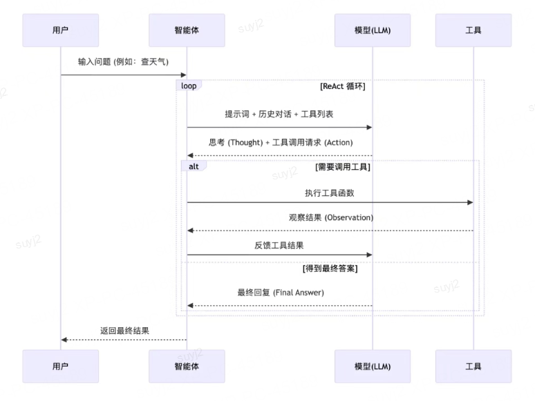

# ReAct：推理与行动的飞轮

## 一句话结论

ReAct（Reasoning + Acting）构建了"推理→行动→观察→推理"的闭环，让模型能调用工具（如Wikipedia搜索）与环境交互，用事实证据支撑推理，大幅减少幻觉。

## 流程图



---

## 1. Why：背景与痛点

### 1.1 纯推理的局限
- **幻觉严重**：模型编造假信息，说得跟真的一样
- **知识截止**：预训练有时间窗口，不知道最新信息
- **无法验证**：模型说的话，不知道对不对

### 1.2 纯行动的局限
- **盲目执行**：不知道为什么要这么做，错了也不知道
- **无法学习**：执行了就执行了，不会从结果中反思
- **缺乏规划**：走一步看一步，没有长远规划

---

## 2. What：ReAct核心概念

### 2.1 ReAct闭环

```
┌─────────┐
│  推理   │ → "我需要查一下特斯拉的成立时间"
└────┬────┘
     │
     ↓
┌─────────┐
│  行动   │ → 调用工具：Search("特斯拉成立时间")
└────┬────┘
     │
     ↓
┌─────────┐
│  观察   │ → 返回：特斯拉成立于2003年
└────┬────┘
     │
     ↓
┌─────────┐
│  推理   │ → "根据搜索结果，特斯拉成立于2003年"
└────┬────┘
     │
     ↓
  (循环或结束)
```

### 2.2 关键要素

| 要素 | 说明 |
|------|------|
| **推理（Reason）** | 思考做什么、为什么这么做 |
| **行动（Act）** | 调用工具（搜索、计算器、API等） |
| **观察（Observe）** | 获取工具返回的结果 |
| **循环** | 推理→行动→观察→推理，直到得到答案 |

---

## 3. How：ReAct实践

### 3.1 典型Prompt模板

```
你是一个智能助手，可以使用以下工具：
- Search(query): 搜索维基百科

请用以下格式操作：
思考：[你的推理过程]
行动：[工具名(参数)]
观察：[工具返回结果]
...（重复思考→行动→观察）
思考：[最终推理]
答案：[最终答案]

问题：{question}
```

### 3.2 常见工具类型

| 工具类型 | 示例 | 用途 |
|---------|------|------|
| **搜索** | Wikipedia, Google | 获取事实信息 |
| **计算器** | 数学计算 | 精确计算 |
| **数据库** | SQL查询 | 查询结构化数据 |
| **API** | 天气, 股票 | 获取实时数据 |

---

## 4. 完整示例：座舱百科问答

### 问题
特斯拉是哪一年成立的？

### ReAct执行过程

| 步骤 | 内容 |
|------|------|
| **思考1** | 我需要知道特斯拉的成立时间，这个信息我不太确定，应该搜索一下。 |
| **行动1** | Search("特斯拉成立时间") |
| **观察1** | 特斯拉（Tesla, Inc.）是一家美国电动汽车和能源公司，成立于2003年。 |
| **思考2** | 根据搜索结果，特斯拉成立于2003年。 |
| **答案** | 2003年 |

---

## 5. ReAct vs 其他方法对比

| 方法 | 工具调用 | 推理 | 减少幻觉 | 代表 |
|------|---------|------|---------|------|
| **标准Prompt** | ❌ | ❌ | ❌ | - |
| **CoT** | ❌ | ✅ | ⭐ | Wei et al. 2022 |
| **工具调用** | ✅ | ❌ | ⭐ | - |
| **ReAct** | ✅ | ✅ | ✅ | Yao et al. 2023 |

---

## 6. 优缺点分析

### 6.1 优点

| 优点 | 说明 |
|------|------|
| **减少幻觉** | 用事实证据支撑推理 |
| **知识更新** | 可以获取最新信息 |
| **可解释性** | 可以看到推理→行动的全过程 |
| **动态学习** | 从观察中学习和调整 |

---

### 6.2 缺点

| 缺点 | 说明 |
|------|------|
| **成本高** | 多次调用模型+工具，成本上升 |
| **延迟高** | 需要等待工具返回，延迟增加 |
| **实现复杂** | 需要工具封装、错误处理等 |

---

## 7. 智能座舱场景：车辆故障查询

### 场景
用户问："特斯拉Model 3的电池质保是多久？"

### ReAct流程

1. **思考**：这个信息需要查车辆手册或官方资料，我搜索一下。
2. **行动**：SearchVehicleManual("Model 3 电池质保")
3. **观察**：特斯拉Model 3的电池质保为8年或16万公里（以先到者为准）。
4. **思考**：根据查询结果，Model 3电池质保是8年/16万公里。
5. **答案**：8年或16万公里（以先到者为准）

---

## 8. 面试官追问清单

### Q1：ReAct和CoT的主要区别是什么？
**回答要点**：
- CoT：只有推理，没有行动，纯"想"
- ReAct：推理+行动+观察，"想"了还能"做"，做完还能"看"
- CoT可能幻觉，ReAct用工具验证，减少幻觉
- ReAct可以获取实时/最新信息，CoT不行

### Q2：ReAct成本高、延迟高，生产环境怎么优化？
**回答要点**：
- 不是所有问题都需要ReAct，用分类器判断要不要用工具
- 工具缓存：相同问题的搜索结果缓存
- 级联策略：先试CoT，答案置信度低再用ReAct
- 异步调用：并行调用多个工具
- 成本和效果权衡，看业务能接受多少

---

## 9. 总结提纲

1. **定义**：ReAct = Reasoning + Acting，推理→行动→观察闭环
2. **核心**：让模型能调用工具，用事实证据支撑推理
3. **流程**：思考→行动→观察→思考，循环直到得到答案
4. **工具**：搜索、计算器、数据库、API等
5. **优点**：减少幻觉、知识更新、可解释、动态学习
6. **缺点**：成本高、延迟高、实现复杂
7. **对比**：ReAct=CoT+工具，比纯CoT或纯工具都强
8. **优化**：级联策略、工具缓存、异步调用、分类器判断
