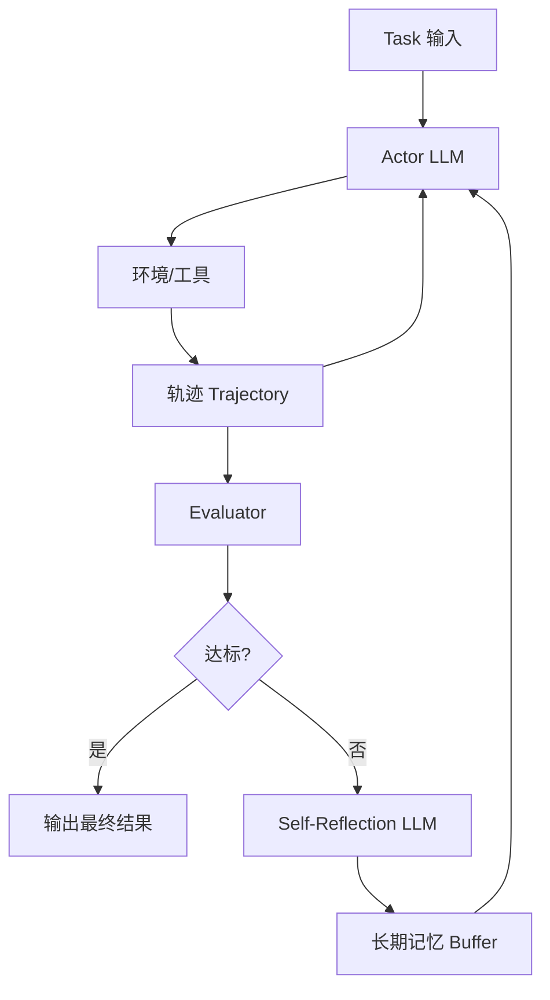

[//]: # (title: 反思（Reflexion）：用"语言化强化学习"让 Agent 吃一堑长一智)

# 反思（Reflexion）：让失败变成下一次的提示词

## 一句话结论

反思（Reflexion）是一种"行动—评估—语言化反思—写入记忆—重试"的 Agent 自我改进范式：把每一轮交互的失败原因用自然语言总结成经验（verbal self-reflection），再把经验注入下一轮的 Prompt 上下文，相当于用"语言化的强化学习"在不更新模型权重的前提下，迭代提升任务成功率。

---

## 1. Why：背景与痛点

### 1.1 业务背景
- **单轮 Agent 容易翻车**：ReAct/CoT 一条链走下来，中间错了就一路错到底，没有"复盘"能力。
- **传统 RL 成本高**：要更新模型权重，需要大规模 rollout + 奖励建模 + 梯度更新，对闭源 API 模型完全不可行。
- **工程落地需要"便宜又能学"的方案**：希望 Agent 在线上跑任务时能从失败中学习，但不能动模型。

### 1.2 技术背景
- **CoT/ReAct 的局限**：无反馈回路，错误模式会反复出现。
- **Self-Refine 的局限**：只改当前输出，不沉淀跨 episode 的经验。
- **LLM 的独特能力**：把数值奖励翻译成自然语言反思，再以上下文方式"记住"——这就是 Reflexion 的立足点。

### 1.3 目标指标
| 指标 | 说明 |
|------|------|
| **任务成功率**（Pass@k） | 经过若干轮反思后是否能解出之前解不出的任务 |
| **迭代收敛步数** | 多少轮反思能达到阈值（通常 3~5 轮） |
| **Token 成本** | 每次反思会把历史注入上下文，需要控制窗口 |
| **幻觉/过度自信率** | 反思是否写出"自以为对"的错误经验 |

---

## 2. What：概念与边界

### 2.1 定义

> **Reflexion**（Shinn et al., 2023）：一种使用**言语反馈（verbal feedback）**强化语言 Agent 的框架。Agent 基于环境反馈（标量奖励或自由文本）生成自然语言反思，存入情景记忆缓冲区（episodic memory），在下次尝试时作为上下文被读取，从而"改进"决策策略——全程不更新 LLM 权重。

### 2.2 三大角色（Actor / Evaluator / Self-Reflection）

| 角色 | 职责 | 实现 |
|------|------|------|
| **Actor** | 在环境中推理并产生动作/输出 | 一个 LLM（通常复用 ReAct/CoT 模式） |
| **Evaluator** | 对 Actor 的轨迹打分/给反馈 | 规则函数、单元测试、另一个 LLM Judge、环境返回码 |
| **Self-Reflection** | 读取轨迹 + 反馈，产出一段反思经验 | 另一个 LLM（可与 Actor 同模型，不同 Prompt） |

### 2.3 两类记忆

| 记忆类型 | 生命周期 | 作用 |
|----------|----------|------|
| **短期记忆（Trajectory）** | 单次 episode 内 | 保存当前轨迹（state, action, obs） |
| **长期记忆（Reflection Buffer）** | 跨 episode | 保存历次反思文本，作为下一轮 Prompt 的"经验池" |

### 2.4 边界与易混淆点

| 易混淆概念 | 与 Reflexion 的差异 |
|-----------|--------------------|
| **Self-Refine** | 只精炼当前输出，不沉淀跨任务经验；反思是"本次内部"的 |
| **Self-Correction** | 更侧重单次推理链内部的错误检测与即时纠正 |
| **CoT-SC（自一致性）** | 只靠多次采样投票，不做反思，链间无交流 |
| **传统 RL** | 更新模型参数；Reflexion 只更新"记忆上下文" |
| **迭代提示（Iterative Prompting）** | 是更宽泛的概念；Reflexion 是其中带评估器+显式语言化经验的特化形态 |

**结论句（可复述）**：Reflexion = ReAct + Evaluator + 语言化经验 + 情景记忆，用文字当梯度。

---

## 3. How：原理 → 流程 → 架构 → 选型 → 实现

### 3.1 原理：为什么"说一段话"等同于"学到东西"

- **上下文即策略**：对 LLM 来说，Prompt 上下文改变 = 策略分布改变，等价于一次"策略更新"。
- **语言化奖励**：把 `reward=0` 翻译成"上一轮在第 3 步搜索关键词太宽泛，应该先筛品牌再筛价格"——信息量远大于一个标量。
- **情景检索**：长期记忆中的反思条目，按任务相似度检索后拼进 Prompt，模拟"经验迁移"。

### 3.2 核心流程（伪代码）

```text
memory = []                                 # 长期反思记忆（跨 episode）
for trial in 1..N:
    trajectory = []
    state = env.reset()
    # —— Actor：执行一次完整任务 ——
    while not done:
        action = Actor(task, state, trajectory, memory)   # memory 作为经验注入
        state, reward, done, info = env.step(action)
        trajectory.append((state, action, info))
    # —— Evaluator：打分 ——
    score, feedback = Evaluator(task, trajectory)
    if score >= threshold:
        return trajectory                    # 已达标，结束
    # —— Self-Reflection：语言化复盘 ——
    reflection = ReflectLLM(task, trajectory, feedback)
    memory.append(reflection)                # 写入长期记忆
return best_trajectory
```

### 3.3 架构拆解



模块职责：
- **Actor**：决策与执行，消费 `task + 短期轨迹 + 长期反思`。
- **Evaluator**：提供客观信号（单元测试/规则/LLM Judge），决定是否要反思。
- **Self-Reflection LLM**：读取失败轨迹 + 反馈，输出结构化经验（建议 3~5 条要点）。
- **Memory Buffer**：存储历次反思，支持截断/去重/相似度检索。

### 3.4 数据结构（建议）

```python
class Reflection:
    task_id: str
    trial: int
    score: float
    root_cause: str         # 失败根因，一句话
    lessons: list[str]      # 下次可用的具体行为建议
    tags: list[str]         # 便于检索
```

### 3.5 技术选型对比

#### 3.5.1 Evaluator 选型

| 方案 | 优点 | 缺点 | 适用场景 |
|------|------|------|---------|
| **规则/单元测试** | 客观、零成本、无幻觉 | 只适用于可验证任务 | 代码生成、数学题、结构化抽取 |
| **环境内建奖励** | 真实反馈 | 奖励稀疏 | 游戏、仿真、RPA |
| **LLM Judge** | 适用面广 | 成本高、可能偏差 | 开放式写作、对话质量 |
| **混合（规则+LLM）** | 兼顾客观与灵活 | 工程复杂 | 生产级 Agent |

#### 3.5.2 反思写入策略

| 策略 | 优点 | 缺点 |
|------|------|------|
| **全量追加** | 简单 | 上下文爆炸、噪声累积 |
| **FIFO 截断** | 控制长度 | 丢失早期经验 |
| **相似度检索（RAG）** | 只取相关经验 | 需要向量库 |
| **摘要压缩** | 长期稳定 | 压缩损失关键细节 |

**推荐组合**：相似度检索 Top-K + 周期性摘要压缩。

### 3.6 关键实现要点

1. **Actor 与 Reflector 用不同 Prompt**：职责分离，避免互相污染。
2. **反思必须结构化输出**（JSON/要点），否则难以检索与去重。
3. **设置最大 trial 数**（通常 3~5），防止死循环。
4. **记录 best_trajectory**：即使最终未达标，也返回历史最优，避免回退。
5. **把任务描述与反思一起 embedding**：便于跨任务迁移经验。

---

## 4. 优化与改进方案（多层次）

### 4.1 工程优化
| 方案 | 收益 | 代价 | 适用条件 | 验证方式 |
|------|------|------|---------|---------|
| 反思条目去重 | 减少 30%~50% 上下文占用 | 轻量 embedding 计算 | 长期运行的 Agent | 监控 prompt_tokens |
| 异步评估 | Actor 不阻塞等待 Judge | 需要消息队列 | 高并发场景 | 观测 P99 延迟 |
| 经验池分层（热/温/冷） | 只热加载高价值经验 | 额外存储与检索 | 经验池 > 100 条 | 命中率统计 |

### 4.2 算法优化
| 方案 | 收益 | 代价 | 适用条件 |
|------|------|------|---------|
| 多 Reflector 投票（类 CoT-SC） | 反思更稳定，不易走偏 | 成本 k 倍 | 高可靠场景 |
| 反思自评（Meta-Reflection） | 过滤掉"自以为对"的错误经验 | 多一次 LLM 调用 | 对幻觉敏感 |
| 将 Reflexion 与 ToT 结合 | 分支内反思，剪枝更智能 | 实现复杂 | 复杂规划任务 |

### 4.3 架构优化
| 方案 | 收益 | 代价 |
|------|------|------|
| 把长期记忆做成共享服务（多 Agent 共用经验） | 团队级知识沉淀 | 权限与污染风险 |
| 经验下沉为 Fine-tune 数据 | 把"上下文学习"固化为"参数学习" | 需要训练资源，闭源 API 不可行 |
| 反思触发条件做分级（小错只改当前，大错才入库） | 降噪 | 需设计阈值策略 |

---

## 5. 适用场景与优缺点

### 5.1 推荐使用
- **可验证任务**：代码生成（HumanEval、MBPP）、SQL 生成、数学推理。
- **长周期 Agent 任务**：WebShop、ALFWorld 等具备成败信号的交互环境。
- **批量相似任务**：同类任务持续来，经验复用收益大。

### 5.2 不推荐使用
- **一次性、低价值任务**：反思成本高于任务本身。
- **高度主观任务**：没有稳定 Evaluator，反思容易跑偏。
- **严格低延迟**：需要重试的场景不适合实时接口。

### 5.3 优缺点与风险

| 维度 | 优点 | 风险 / 缓解 |
|------|------|-------------|
| 性能 | 不动权重就能提升 | 上下文窗口压力 → 检索+压缩 |
| 可靠性 | 失败→经验的闭环 | 写入错误经验会"越学越歪"→ Meta-Reflection + 人工审核 |
| 成本 | 比 RL 便宜几个数量级 | 多次 trial 仍放大成本 → 限制最大重试数 |
| 可解释性 | 经验是自然语言，可读可审计 | 反思可能"说得好听但没用" → 对经验做 A/B 验证 |

---

## 6. 智能座舱落地举例

**场景**：车机语音助手「帮我找一家 30 公里内、评分 4.5 以上、能停车且儿童友好的川菜馆」。

- **第 1 次（失败）**：Actor 先搜"川菜"→ 返回 200 条，再逐条筛选停车位，超时。Evaluator 反馈"耗时 8s，用户已放弃"。
- **Self-Reflection**：*"筛选链路顺序错了：应先按距离+评分硬过滤，再用结构化字段筛停车/儿童友好，最后再做语义排序。"*
- **第 2 次（成功）**：Actor 按反思重排流程，1.8s 返回 5 条候选。
- **经验入库**：标签 `poi_search/multi_constraint`，下次搜"20 公里内带 KTV 包厢的粤菜馆"时自动命中该反思，复用筛选顺序。

映射到结构：此例对应 How → 流程 + 架构；体现了"语言化经验可跨任务迁移"。

---

## 7. 面试官追问清单

### Q1：Reflexion 与 Self-Refine / Self-Correction 的本质区别？
**要点**：Self-Refine 只在本次输出上迭代；Self-Correction 侧重单链内的即时纠错；Reflexion 引入了**跨 episode 的长期记忆 + 独立 Evaluator**，更接近"语言化 RL"。

### Q2：为什么说 Reflexion 是"语言化的强化学习"？它和真 RL 的区别？
**要点**：RL 更新的是参数（梯度下降），Reflexion 更新的是上下文（自然语言经验）；前者需要可导损失与大量 rollout，后者只需 Evaluator 信号与 Prompt 拼接；但 Reflexion 不持久化到权重，换模型即丢失。

### Q3：Evaluator 怎么设计？没有明确奖励怎么办？
**要点**：优先用客观信号（单元测试、规则、环境返回码）；无法量化时用 LLM-as-Judge 并做 rubric 锚定；关键是要**稳定、可复现、低偏差**；必要时用规则 + LLM 的混合 Judge。

### Q4：反思条目会不会越积越多，撑爆上下文？
**要点**：用相似度检索 Top-K；周期摘要压缩；分层经验池（热/温/冷）；必要时把高频经验蒸馏进系统提示。

### Q5：怎么压测与验收？
**要点**：固定任务集 + 固定随机种子，统计 Pass@1 / Pass@k；跟踪 trial 收敛曲线；做消融（关闭记忆 vs 开启记忆）；监控 token 成本与 P99 延迟。

### Q6：反思写了错的经验怎么办（走火入魔）？
**要点**：加 Meta-Reflection（对反思再打分）；对经验做 A/B 对照（使用 vs 不使用）；设置过期策略；关键经验走人工审核。

### Q7：Reflexion 能结合 ToT/GoT 吗？
**要点**：可以。ToT 在分支节点失败时触发局部反思并剪枝；GoT 可把反思作为节点聚合的边权，实现"有经验加持的图搜索"。

### Q8：怎么灰度与回滚？
**要点**：经验池做版本化（类似 feature flag）；新经验先进灰度桶，命中率/成功率达标后再进全量；出问题直接回滚经验池版本。

---

## 8. 总结提纲（可背诵）

1. **定义**：Reflexion = Actor + Evaluator + Self-Reflection + 长期记忆，用语言充当梯度。
2. **三角色**：Actor 执行、Evaluator 评分、Reflector 产出自然语言经验。
3. **两记忆**：短期 trajectory（单 episode）、长期 reflection buffer（跨 episode）。
4. **流程五步**：执行→评估→不达标→反思→注入记忆→重试。
5. **本质**：不更新权重，更新上下文；成本远低于 RL。
6. **优点**：可验证任务上显著提升 Pass@k；经验可读、可迁移、可审计。
7. **局限**：Evaluator 质量决定上限；长期记忆需治理；可能写入错误经验。
8. **优化**：检索 Top-K、摘要压缩、Meta-Reflection、多 Reflector 投票。
9. **适用**：代码/SQL/数学/交互式 Agent；不适合一次性、主观、低延迟任务。
10. **演进**：Reflexion → 与 ToT/GoT/多 Agent 记忆共享 结合，形成更高阶自治系统。

---

## 9. 需要检索 / 核对的信息清单

- Reflexion 原始论文：Shinn, N., Cassano, F., et al. *Reflexion: Language Agents with Verbal Reinforcement Learning*（NeurIPS 2023，arXiv:2303.11366）——核对 Actor/Evaluator/Self-Reflection 的原始定义与实验基准（HumanEval、ALFWorld、WebShop 的 Pass@1 数值）。
- 与 Self-Refine（Madaan et al., 2023）、Self-Correction 系列论文的实验对比数据。
- 主流 Agent 框架（LangGraph、LlamaIndex Agents、AutoGen）中 Reflexion 模块的官方示例与最新 API 变动。
- 生产环境中长期记忆治理的最佳实践（去重阈值、过期策略、审核流程）。
