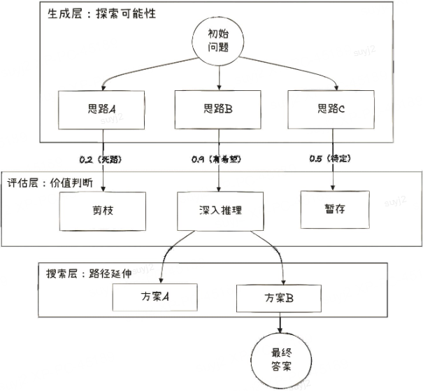
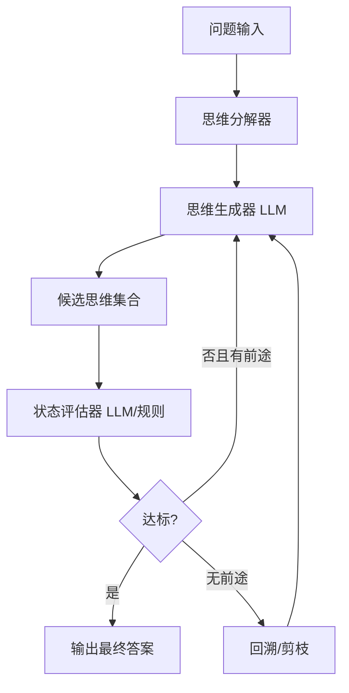

# 思维树（Tree-of-Thought, ToT）：让推理从一条线变成一片林

## 一句话结论

思维树（ToT）将 LLM 的概率生成能力与经典启发式搜索算法（BFS/DFS/Beam Search）相结合，把推理建模为一个**可分支、可评估、可回溯**的树状状态空间。它不再是"一条路走到黑"的线性链条，而是"步步为营、见死回头"的全局搜索——让模型在复杂问题中具备规划、试错和剪枝能力。

---

## 1. Why：背景 / 痛点 / 目标 / 约束

### 1.1 线性推理的致命缺陷

| 缺陷 | 说明 |
|------|------|
| **不可回溯** | CoT 一旦中间步骤走偏，后续全部基于错误前提展开 |
| **搜索空间为 1** | 每一步只走一条路，无法探索替代方案 |
| **缺乏全局视角** | 无法对"当前状态距离目标还有多远"做出判断 |

### 1.2 业务驱动

在需要**多步规划、多约束满足、创意生成**的场景中，单链推理的成功率随步骤数指数衰减。典型任务：
- 24 点数学游戏（需要尝试多种运算组合）
- 创意写作规划（段落间需要全局一致性）
- 多约束调度/路径规划（充电 + 接娃 + 限时）

### 1.3 架构本质：从黑盒到状态机

ToT 的核心跃迁在于：**将 LLM 的概率生成能力与搜索算法框架解耦**。
- LLM 不再是端到端黑盒，而是**状态生成器**（给定当前状态，输出候选下一步）。
- 搜索算法是**调度器**（决定何时生成、何时评估、何时回溯/剪枝）。

### 1.4 约束与目标指标

| 目标 | 说明 |
|------|------|
| 成功率（Pass@1） | 在复杂任务上相比 CoT 显著提升 |
| Token 预算 | 树的宽度×深度决定成本上界 |
| 延迟 | 搜索式推理天然慢于单链，需要在质量与时间间权衡 |
| 可解释性 | 保留完整搜索树，可复盘每一步决策理由 |

---

## 2. What：概念 / 边界 / 核心组成

### 2.1 核心定义

> **Tree-of-Thought (ToT)**（Yao et al., 2023）：一种通用的 LLM 推理框架，将思维过程建模为有向树。树的每个节点是一个"思维状态"，边表示一次"思维步骤"的生成。通过搜索算法在树上遍历，辅以启发式评估剪枝，找到从根节点（问题）到叶节点（答案）的最优路径。

在思维树模式下，Agent 不再是"一气呵成"的作家，而是"步步为营"的棋手。其核心机制是将 LLM 的概率生成过程重构为思维空间中的启发式搜索过程，依赖三个核心原语——分解(Decomposition)、生成(Generation)与评估(Evaluation)的紧密配合。



### 2.2 四大核心模块

| 模块 | 职责 | 关键设计决策 |
|------|------|--------------|
| **思维分解 (Thought Decomposition)** | 确定"一步"的粒度 | 太细→搜索爆炸；太粗→丧失分支价值 |
| **思维生成 (Thought Generator)** | 给定当前状态，产出 k 个候选下一步 | 采样策略（temperature/top_p）；提议式 vs 序列式 |
| **状态评估器 (State Evaluator)** | 对候选状态打分（启发式函数） | 评估准确性直接决定剪枝质量 |
| **搜索算法 (Search Algorithm)** | 全局调度遍历策略 | BFS / DFS / Beam Search / MCTS |

### 2.3 关键术语对齐

| 术语 | 含义 | 类比 |
|------|------|------|
| 思维（Thought） | 推理过程中的一个中间步骤/状态 | 棋局中的一步走法 |
| 分支因子（Branching Factor, b） | 每个节点生成的候选数 | 国际象棋平均 ~35 |
| 搜索深度（Depth, d） | 从根到叶的步骤数 | 问题的"推理步数" |
| 评估函数 | LLM 对中间状态的打分/分类 | 棋类引擎的局面评估 |

### 2.4 边界与易混淆概念

| 概念 | 与 ToT 的核心区别 |
|------|-----------------|
| **CoT（思维链）** | 线性单链，无分支、无评估、无回溯 |
| **CoT-SC（自一致性）** | 多条完整链投票；链间独立，不在中间步骤交互 |
| **GoT（思维图）** | 允许多父节点（DAG/图），信息可聚合；ToT 严格是树 |
| **MCTS** | 在 ToT 基础上加上 rollout + 反向传播，是 ToT 的进阶形态 |
| **Beam Search decoding** | token 级别的束搜索；ToT 是"思维"级别的束搜索 |

**结论句**：ToT = 思维分解 + 多候选生成 + 启发式评估 + 树搜索调度，让推理从"一条线"变成"一片林"。

---

## 3. How：原理 → 流程 → 架构 → 选型 → 实现要点

### 3.1 原理：为什么能行

- **分支引入冗余**：每步生成 k 个候选，总路径空间 = k^d，用搜索从中找最优。
- **评估实现剪枝**：在中间步骤就判断"有没有前途"，避免走完全部路径才发现不对。
- **回溯保证鲁棒**：某分支走不通时回退尝试其他分支，不会"将错就错"。
- **复杂度瓶颈**：LLM 调用次数 = O(b × d)（BFS per level）或 O(b^d)（全搜索），需要靠评估+剪枝控制实际开销。

### 3.2 核心流程（伪代码）

```text
def tree_of_thought(problem, max_depth, branch_factor, search_algo):
    root = State(problem)
    if search_algo == "BFS":
        queue = [root]
        for depth in 1..max_depth:
            candidates = []
            for state in queue:
                thoughts = generate_thoughts(state, k=branch_factor)
                scores = [evaluate(state, t) for t in thoughts]
                candidates.extend(zip(thoughts, scores))
            # 保留 top-b 个候选进入下一层
            queue = top_k(candidates, k=beam_width)
            if any_terminal(queue):
                return best_terminal(queue)
    elif search_algo == "DFS":
        return dfs(root, max_depth, branch_factor)
```

### 3.3 流程示意图

```text
      [初始状态: 问题]
       /     |      \
   [思维A] [思维B] [思维C]    ← 思维生成 (k=3)
     |       |       |
   (0.8)   (0.6)  (0.1)      ← 状态评估 (打分)
     |       |       X        ← 剪枝 (< 阈值)
    / \     / \
  [A1][A2] [B1][B2]           ← 下一层生成
   |   X    |   |
  (0.9)   (0.7)(0.5)         ← 再次评估
   |        |
  [答案✓] [继续...]
```

### 3.4 架构拆解



模块间接口：
- **思维分解器 → 生成器**：传递粒度约束（Prompt 模板）
- **生成器 → 评估器**：传递 `(parent_state, candidate_thought)` 对
- **评估器 → 搜索调度**：返回 `score ∈ [0,1]` 或分类标签 `{Sure, Maybe, Impossible}`
- **搜索调度 → 生成器**：选择下一个要展开的节点

### 3.5 技术选型对比

#### 3.5.1 搜索算法选型

| 算法 | 优点 | 缺点 | 复杂度（LLM 调用） | 适用场景 |
|------|------|------|--------------------|---------| 
| **BFS** | 逐层推进，保证找到最短路径；易于并行 | 内存占用大（保留整层） | O(b × d) per level | 步骤少(d≤5)、需要全局最优 |
| **DFS** | 内存友好；快速找到一个解 | 可能陷入长分支；不保证最优 | 最坏 O(b^d) | 深度大但剪枝强的场景 |
| **Beam Search** | 折中：限制宽度控制成本 | beam_width 选择敏感 | O(beam × d) | 工程落地首选 |
| **MCTS** | 有价值反传播，理论最优 | 实现复杂、需要 rollout | O(n_simulations) | 博弈/游戏类任务 |

**选择依据**：
- 优先 Beam Search（成本可控、工程简单）
- 当任务有明确终止条件（如数学题可验算），DFS + 剪枝性价比高
- 需要极致性能且 rollout 可行时，升级到 MCTS

#### 3.5.2 评估器选型

| 方案 | 优点 | 缺点 | 适用场景 |
|------|------|------|----------|
| **同模型自评（Value Prompt）** | 简单，不需额外模型 | 自我偏差，"自己评自己"可能过度乐观 | 快速原型 |
| **独立 Judge 模型** | 减少偏差 | 额外 API 成本 | 生产级 |
| **规则/启发式函数** | 零成本、确定性 | 只适用于可形式化的任务 | 数学题、代码题 |
| **LLM + 规则混合** | 兼顾灵活与客观 | 工程复杂 | 复杂生产场景 |

#### 3.5.3 思维生成策略

| 策略 | 做法 | 适用场景 |
|------|------|----------|
| **独立采样（Sample）** | 同一 Prompt，不同 temperature，独立生成 k 条 | 思维空间大（创意/开放） |
| **提议式（Propose）** | 一次 Prompt 让 LLM 列出 k 个候选 | 思维空间小（约束/数学） |

### 3.6 关键实现要点

1. **思维粒度是核心设计决策**：太细（每个 token）= 退化为 Beam Search decoding；太粗（整个推理）= 退化为 CoT-SC。经验法则：一个"思维"≈一段可独立评估的逻辑片段（1~3 句话）。
2. **评估 Prompt 需要标定**：建议提供 Few-shot 评估示例，并用 {Sure, Maybe, Impossible} 三级标签而非连续分数（减少校准成本）。
3. **并行化**：同一层的 k 个候选可并行调用 LLM 生成 & 评估，用 `asyncio` / `ThreadPool` 实现。
4. **Early Stop**：一旦某叶节点通过验证（如数学题验算正确），即刻返回，不必搜索完全树。
5. **Token 预算控制**：设置全局 `max_tokens_budget`，搜索用完即停，返回当前最优。

---

## 4. 优化与改进方案（多层次）

### 4.1 工程优化

| 方案 | 收益 | 代价 | 适用条件 | 验证方式 |
|------|------|------|---------|----------|
| **并行生成 & 评估** | 延迟降低 k 倍 | 并发 API 配额 | 每层候选 ≥ 3 | P50/P99 延迟 |
| **缓存相同子状态** | 避免重复 LLM 调用 | 内存占用 | 任务存在重复子结构 | cache hit rate |
| **分层 temperature** | 浅层高多样、深层低精准 | 需要调参 | 通用 | 分支存活率 |
| **异步流式输出** | 用户看到中间进展 | 工程复杂度 | 用户交互场景 | 用户体验测试 |

### 4.2 算法/模型优化

| 方案 | 收益 | 代价 | 适用条件 |
|------|------|------|----------|
| **轻量评估模型（蒸馏）** | 评估成本降 5~10x | 精度下降 | 调用量大、评估任务可标注 |
| **自适应分支因子** | 简单步骤少分支、难步骤多分支 | 需要难度预估 | 步骤难度差异大的任务 |
| **价值网络 (Value Network)** | 更精准的状态评估 | 需要 RL 训练 | 有大量 rollout 数据 |
| **混合推理策略** | 简单子问题用 CoT，难子问题用 ToT | 路由器设计 | 混合难度任务 |

### 4.3 架构优化

| 方案 | 收益 | 代价 |
|------|------|------|
| **ToT + Reflexion** | 失败树记入经验，下次搜索方向更优 | 需要跨 episode 记忆 |
| **分布式搜索** | 超大树可多节点并行 | 通信开销 |
| **渐进式深化（Iterative Deepening）** | 先浅搜快速返回，再深搜精化 | 重复计算 |

---

## 5. 适用场景与优缺点 / 风险

### 5.1 推荐使用

| 场景 | 说明 | 推荐搜索算法 |
|------|------|-------------|
| **数学/逻辑推理** | 24 点、数独、组合优化 | DFS + 验算剪枝 |
| **创意写作规划** | 需要全局结构一致性 | BFS（逐层保留最佳段落） |
| **多约束调度** | 多目标 + 硬约束 | Beam Search |
| **代码生成（复杂函数）** | 多种实现路径可选 | DFS + 单元测试剪枝 |
| **博弈/策略规划** | 对手模型 + 前瞻搜索 | MCTS |

### 5.2 不推荐使用

| 场景 | 原因 |
|------|------|
| **简单直觉类任务** | CoT 甚至 Zero-shot 足够，ToT 杀鸡用牛刀 |
| **严格低延迟（<1s）** | 搜索式推理天然多次 LLM 调用 |
| **答案不可评估** | 评估器无法给出有效反馈，剪枝失效 |
| **预算极度有限** | b×d 次 LLM 调用是硬开销 |

### 5.3 优缺点与风险

| 维度 | 优点 | 风险 / 缓解 |
|------|------|-------------|
| **准确性** | 复杂任务（如 24 点）从 4% 提升至 74%（论文数据） | 评估器不准→剪掉正确分支 → 用置信度阈值做软剪枝 |
| **鲁棒性** | 死胡同可回溯 | 搜索空间爆炸 → 严格控制 beam_width 和 max_depth |
| **可解释性** | 完整搜索树可复盘 | 树太大难以人工审计 → 日志摘要 |
| **成本** | 多次调用放大费用 | → Early Stop + Token 预算 + 缓存 |
| **延迟** | 比 CoT 慢数倍 | → 并行 + 轻量评估模型 |

---

## 6. 智能座舱 / 智能驾驶举例

### 6.1 智能座舱：多约束出行规划（映射 → How 流程 + 架构）

**场景**：用户说"今天下午 3 点前要去接孩子，路上要买束花，还要顺便给车充个电，推荐最省时间的路线"。

**ToT 推理过程**：
- **思维分解**：拆成"确定目的地顺序 → 计算各段耗时 → 检查约束 → 给出方案"四步。
- **层级 1（分支）**：生成多个顺序——先买花→充电→接娃 / 先充电→买花→接娃 / 买花+充电同地点（有快充的花店附近）。
- **层级 2（评估）**：对每条路径估算总耗时（调用导航 API），标注 Sure/Maybe/Impossible。
- **层级 3（剪枝）**：超时路线剪掉（如充电需 40 分钟的方案 Impossible）。
- **输出**：返回 Sure 中耗时最短的路径，并附上备选（Maybe 的方案 + 前提条件说明）。

### 6.2 智能驾驶：行为规划（映射 → Why 搜索空间 + What 评估器）

**场景**：自动驾驶系统在复杂路口需要决策——直行 / 变道 / 让行。

- 分支因子 b：3（三种基本行为）× 速度档位 = ~9 候选
- 评估器：安全分（碰撞 TTC）+ 效率分（通过时间）+ 舒适分（加速度）
- 搜索：前瞻 3 秒（d=3 步 × 1s），DFS + 安全硬约束剪枝
- 回溯：若预测 2 秒后车道被占，回退到"让行"分支

---

## 7. 面试官追问清单

### Q1：ToT 与 Self-Consistency（自一致性）的本质区别？
**要点**：Self-Consistency 生成多条**完整**链后投票，链间独立、无中间步骤交互；ToT 在**中间步骤**进行分支+评估+搜索，具有局部控制和纠错能力。类比：SC 是"多人独立做题投票"，ToT 是"一个人步步为营、走错就退"。

### Q2：评估器的准确性对 ToT 影响有多大？
**要点**：评估器是 ToT 的"命门"。评估不准 → 好分支被错误剪掉（假阴性）或烂分支被保留（假阳性）。建议用"软评估"（保留 Maybe 而非只保留 Sure）+ 动态调整阈值 + 最终结果验证兜底。

### Q3：ToT 的 LLM 调用次数怎么估算和控制？
**要点**：每层调用 = beam_width ×（生成调用 + 评估调用）；总调用 ≈ 2 × beam × depth。控制手段：① 限 beam_width；② 限 max_depth；③ 设 token_budget 硬上限；④ Early Stop。

### Q4：为什么不直接用 MCTS 而用 ToT？
**要点**：MCTS 需要 rollout（模拟到终局）+ 价值反传，对 LLM 来说 rollout 成本极高；ToT 用启发式评估替代 rollout，是成本-效果的工程折中。当有廉价 rollout 手段（如代码题可直接跑测试）时，MCTS 更优。

### Q5：思维粒度怎么选？选错了会怎样？
**要点**：太细（token 级）→ 退化为 beam search decoding，搜索空间爆炸；太粗（整段推理）→ 退化为 CoT-SC，失去中间控制力。经验法则：一个思维 = 一段可独立评估的逻辑单元（1~3 句话或一个推理步骤）。

### Q6：ToT 怎么与 Reflexion 结合？
**要点**：搜索失败后（所有叶节点都不满足），触发 Reflexion 生成"语言化经验"→ 下轮搜索时把经验注入 Prompt → 引导生成器避开已知死路。等价于"经验指导的启发式搜索"。

### Q7：如何做灰度/回滚？
**要点**：① 搜索参数（beam_width, max_depth）可灰度调整；② 评估器可 A/B 对比（新旧评估器的剪枝命中率）；③ 保留完整搜索日志，出问题可复盘定位是生成器还是评估器的锅。

### Q8：瓶颈在哪？怎么压测？
**要点**：瓶颈 = LLM 调用延迟 × 调用次数。压测：固定任务集 + 不同 beam/depth 组合，画出"准确率-延迟-成本"Pareto 曲线；监控 P50/P99 延迟、token 总消耗、评估器剪枝率。

---

## 8. 总结提纲（可背诵）

1. **定义**：ToT = 思维分解 + 多候选生成 + 启发式评估 + 树搜索调度。
2. **四模块**：分解器确定粒度、生成器产出候选、评估器打分剪枝、搜索算法调度遍历。
3. **与 CoT 的区别**：CoT 是线（不可回溯），ToT 是树（可分支、可评估、可回退）。
4. **与 CoT-SC 的区别**：SC 多链独立投票，ToT 中间步骤即分支评估。
5. **搜索选择**：工程首选 Beam Search；数学/代码选 DFS + 验算剪枝；博弈选 MCTS。
6. **评估器是命门**：评估不准则"好枝被砍、烂枝保留"→ 用软剪枝 + 验证兜底。
7. **成本公式**：LLM 调用 ≈ 2 × beam_width × depth（生成 + 评估）。
8. **优化**：并行调用、轻量评估模型、自适应分支因子、缓存子状态、Token 预算。
9. **适用**：复杂约束/搜索空间大/需要前瞻规划的任务；不适合简单直觉题和低延迟场景。
10. **演进方向**：ToT → GoT（图结构，允许聚合）→ ToT + Reflexion（经验指导搜索）→ MCTS（价值反传播）。

---

## 9. 需要检索 / 核对的信息清单

- ToT 原始论文：Yao, S., et al. *Tree of Thoughts: Deliberate Problem Solving with Large Language Models*（NeurIPS 2023, arXiv:2305.10601）——核对 24 点游戏 / 创意写作 / 迷你填字的实验数据。
- ToT 与 GoT 的性能对比数据（Besta et al., 2023, *Graph of Thoughts*）。
- 主流框架实现（LangChain `TreeOfThought`、LlamaIndex `TreeReasoner`）的最新 API 变动与版本。
- MCTS + LLM 的最新进展（如 AlphaCode 2、rStar 等）的具体实验数据。
- Beam Search 工程实现中 beam_width 对成本-准确率的 Pareto 曲线参考数据。
