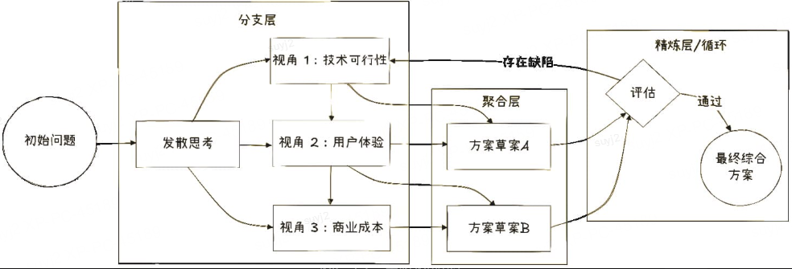
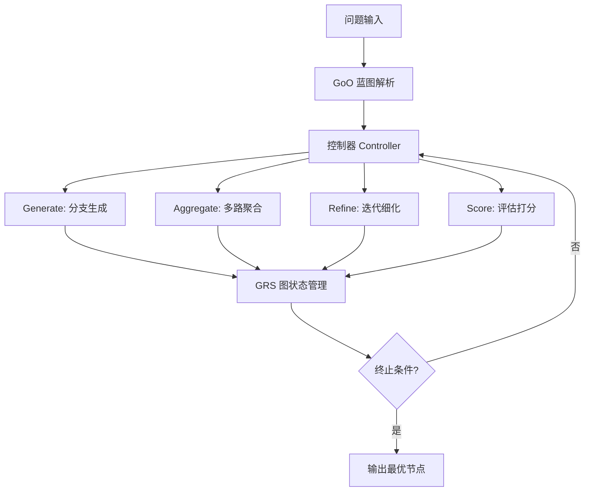

# 思维图（Graph-of-Thought, GoT）：让推理路径之间"互通有无"

## 一句话结论

思维图（GoT）将 LLM 推理过程建模为**有向图（DAG）**，突破 CoT 的线性限制和 ToT 的树状孤立分支限制，允许思维节点之间进行**聚合（多入一出）、细化（自循环）、合并（多路协同）**——让不同推理路径的中间成果可以交叉验证并汇总，模拟人类"多线程思考后综合判断"的认知模式。

---

## 1. Why：背景 / 痛点 / 目标 / 约束

### 1.1 从"线"到"树"再到"图"的演进

| 范式 | 拓扑 | 核心能力 | 致命缺陷 |
|------|------|----------|----------|
| **CoT（思维链）** | 线（单链） | 显式化推理步骤 | 不可回溯，一步错步步错 |
| **CoT-SC（自一致性）** | 多条平行线 | 投票提升鲁棒性 | 链间独立，无信息共享 |
| **ToT（思维树）** | 树 | 分支+评估+回溯 | 分支间孤立，无法合流 |
| **GoT（思维图）** | 有向图/DAG | 分支+聚合+细化+合并 | 工程复杂、调度设计难 |

### 1.2 ToT 的瓶颈：分支间的"信息孤岛"

- **问题**：ToT 中分支 A 发现了关键线索，分支 B 完全用不上——就像两个调研组各自闭门造车，最后只能二选一，无法取长补短。
- **GoT 的解法**：允许多个父节点的输出汇入同一个子节点（聚合操作），实现"路径间的信息协同"。

### 1.3 业务驱动

需要**综合多源信息**的场景：
- 长文档摘要（分段摘要 → 聚合 → 全局摘要）
- 多目标优化（成本路径 + 时间路径 + 舒适路径 → 合并最优解）
- 代码重构（多个子模块方案 → 接口聚合 → 整体架构）
- 复杂行程规划（会议排期 + 餐厅搜索 + 交通约束 → 综合方案）

### 1.4 目标指标与约束

| 目标 | 说明 |
|------|------|
| 推理质量 | 相比 ToT，在需要综合判断的任务上提升准确率/质量 |
| 信息利用率 | 中间推理成果不浪费，可被其他路径复用 |
| Token 成本 | 图的边数 > 树，需要控制聚合操作的频率 |
| 工程复杂度 | 需要状态管理框架，比 ToT 实现难度更高 |

---

## 2. What：概念 / 边界 / 核心组成

### 2.1 核心定义

> **Graph-of-Thought (GoT)**（Besta et al., 2023）：一种将 LLM 推理建模为有向图的框架。每个思维节点既能生成多个子节点（分支），亦可接收多个父节点的输入（聚合），实现信息的汇聚与重组。这种支持**分支（多输出）和聚合（多输入）**的特性，模拟了动态规划等高级推理模式。



### 2.2 三大核心组件

| 组件 | 职责 | 说明 |
|------|------|------|
| **思维节点 (Thought Nodes)** | 推理的中间状态/结论 | 与 ToT 相同，但可有多个入边 |
| **有向边 (Directed Edges)** | 依赖关系 & 信息流方向 | 支持多入一出（聚合）和一入多出（分支） |
| **控制器 (Graph of Operations, GoO)** | 调度 LLM 执行各种变换 | 定义执行蓝图（哪些节点何时触发何种操作） |

### 2.3 核心变换操作（GoT 的灵魂）

| 操作 | 描述 | 图形特征 | 类比 |
|------|------|----------|------|
| **生成 (Generate)** | 从当前节点产生新子节点 | 1→k（扇出） | 同 ToT 的思维生成 |
| **聚合 (Aggregate)** | 将多个节点的结论合并为一个新节点 | k→1（汇聚） | **GoT 独有**，如 MapReduce 的 Reduce |
| **细化 (Refine)** | 对同一节点迭代改进 | 自环 / 原地替换 | 类似 Self-Refine |
| **评估 (Score)** | 对节点打分 | 不改变图结构 | 同 ToT 的评估器 |

**结论句**：GoT = ToT + 聚合操作 + 细化操作，让推理路径之间从"孤岛"变成"协作网络"。

### 2.4 关键术语对齐

| 术语 | 含义 |
|------|------|
| GoO（Graph of Operations） | 执行蓝图，预定义操作的有向图（何时生成/聚合/细化） |
| GRS（Graph Reasoning State） | 运行时状态，记录当前所有节点及其内容与分数 |
| Volume（卷） | GoT 论文中的核心 benchmark：对列表进行排序/合并的分治任务 |

### 2.5 边界与易混淆概念

| 概念 | 与 GoT 的核心区别 |
|------|-----------------|
| **ToT（思维树）** | 严格树结构，节点只有一个父节点；路径间无信息共享 |
| **CoT-SC（自一致性）** | 多链独立投票，链间完全不交互；GoT 中间即可聚合 |
| **Self-Refine** | 只对单一输出做迭代改进；GoT 的细化是图中一种操作，可与聚合/分支组合 |
| **DAG 执行（DEPS）** | 侧重任务调度的依赖管理；GoT 侧重推理过程中的信息流动与合并 |
| **动态规划** | GoT 的聚合操作天然契合 DP 思想（子问题结果合并为大问题答案） |

---

## 3. How：原理 → 流程 → 架构 → 选型 → 实现要点

### 3.1 原理：为什么"图"比"树"强

- **信息复用**：分支 A 的中间发现可以被分支 B 引用，避免重复推理。
- **分治+合并**：复杂问题分解为子问题后，子答案可以**聚合**为全局答案（类似 MapReduce / 归并排序）。
- **迭代精化**：不满意的节点可以"原地升级"（细化），而不需要从根重新搜索。
- **本质**：GoT 将推理建模为**信息加工的数据流图**——节点是数据状态，边是变换操作。

### 3.2 核心流程（分治-聚合范式）

```text
[问题: 对64个数排序]
       |
   (分解为子问题)
   /    |    \    \
[子1] [子2] [子3] [子4]    ← 各子列表独立排序（Generate）
  |     |     |     |
(Sort) (Sort)(Sort)(Sort)  ← 各子列表内部细化（Refine）
  \     |     |    /
   \    |    /   /
    \   |  /   /
     \  | /  /
      [聚合: 归并排序]       ← Aggregate：合并4个有序子列表
         |
      [最终答案]
```

### 3.3 通用流程（伪代码）

```text
def graph_of_thought(problem, operations_blueprint):
    graph = init_graph(problem)          # 初始化图，根节点=问题
    for op in operations_blueprint:      # 按 GoO 蓝图执行
        if op.type == "generate":
            new_nodes = llm_generate(op.source_nodes, k=op.branch_factor)
            graph.add_nodes(new_nodes, parents=op.source_nodes)
        elif op.type == "aggregate":
            merged = llm_aggregate(op.source_nodes)    # 多入一出
            graph.add_node(merged, parents=op.source_nodes)
        elif op.type == "refine":
            improved = llm_refine(op.target_node)       # 自环迭代
            graph.update_node(op.target_node, improved)
        elif op.type == "score":
            score = llm_evaluate(op.target_node)
            graph.set_score(op.target_node, score)
    return graph.best_terminal_node()
```

### 3.4 架构拆解



关键模块：
- **GoO（操作蓝图）**：预定义整个推理的操作序列和触发条件（类似工作流 DAG）
- **Controller（控制器）**：按蓝图调度 LLM，执行具体操作
- **GRS（图推理状态）**：维护所有节点的内容、分数、边关系
- **Prompter**：为每种操作构造对应的 Prompt 模板

### 3.5 技术选型对比

#### 3.5.1 GoT vs ToT vs CoT-SC 全维度对比

| 维度 | CoT-SC | ToT | GoT |
|------|--------|-----|-----|
| **拓扑** | 多条平行线 | 树 | 有向图/DAG |
| **信息共享** | 无（链间独立） | 无（分支间孤立） | **有**（聚合操作） |
| **回溯** | 无 | 有 | 有 |
| **合并** | 只有最终投票 | 无 | **中间步骤即可合并** |
| **迭代精化** | 无 | 无（需重新搜索） | **有**（Refine 操作） |
| **工程复杂度** | ⭐ | ⭐⭐ | ⭐⭐⭐ |
| **适用任务** | 有唯一答案的题 | 搜索空间大的规划题 | 需要综合多源信息的复杂题 |

#### 3.5.2 聚合策略选型

| 策略 | 优点 | 缺点 | 适用场景 |
|------|------|------|----------|
| **LLM 直接聚合** | 灵活，能处理语义级合并 | 成本高、可能引入幻觉 | 开放式摘要、方案综合 |
| **规则聚合（如归并排序）** | 确定性、零成本 | 只适用于可形式化的任务 | 排序、集合运算、数值合并 |
| **加权拼接** | 简单 | 信息可能冗余 | 快速原型 |
| **投票+精选** | 保留最佳 | 丢失互补信息 | 选择题类 |

#### 3.5.3 操作蓝图（GoO）设计模式

| 模式 | 描述 | 适用场景 |
|------|------|----------|
| **分治-聚合 (Divide-Aggregate)** | 分→独立处理→聚合 | 排序、摘要、代码模块化 |
| **生成-评估-精化 (Generate-Score-Refine)** | 生成后评分，不达标则迭代 | 写作润色、方案优化 |
| **多视角-合并 (Multi-Perspective-Merge)** | 从不同角度分析→合并结论 | 多目标优化、辩证分析 |
| **层次分解-逐层聚合** | 自顶向下分解，自底向上聚合 | 长文档处理、大规模任务 |

### 3.6 关键实现要点

1. **GoO 蓝图需要预设计**：不同于 ToT 的动态搜索，GoT 通常需要一个预定义的操作流程图（GoO），描述何时分支、何时聚合。这要求开发者对任务结构有先验认知。
2. **聚合 Prompt 是核心难点**：如何让 LLM "真正综合"而非"简单拼接"——需要在 Prompt 中明确要求"取长补短、去重去矛盾、产出新洞察"。
3. **状态管理必须程序化**：需要一个图数据结构（节点+边+内容+分数），并在每步操作后更新。
4. **细化操作需设上限**：Refine 可能无限循环 → 设置 max_iterations 或 score 阈值。
5. **并行化天然适合**：同一层的多个独立节点（无依赖关系的）可并行生成/评估。
6. **与 RAG 结合**：聚合时引入外部知识检索，提升合并质量。

---

## 4. 优化与改进方案（多层次）

### 4.1 工程优化

| 方案 | 收益 | 代价 | 适用条件 | 验证方式 |
|------|------|------|---------|----------|
| **并行执行无依赖节点** | 延迟降低 k 倍 | 并发 API 配额 | 图中存在并行分支 | P50/P99 延迟 |
| **增量聚合（Streaming Aggregate）** | 不必等所有子节点完成再聚合 | 可能损失全局信息 | 子节点数量多时 | 输出质量对比 |
| **节点内容缓存+去重** | 避免重复 LLM 调用 | 内存开销 | 存在相似子问题 | cache hit rate |
| **懒加载（Lazy Evaluation）** | 只在需要时才展开节点 | 控制逻辑复杂 | 图很大但最终只用部分 | 实际 LLM 调用数 |

### 4.2 算法/模型优化

| 方案 | 收益 | 代价 | 适用条件 |
|------|------|------|----------|
| **动态 GoO（自适应蓝图）** | 根据中间结果动态决定是否聚合 | 需要元决策模型 | 任务结构不确定时 |
| **轻量聚合模型（蒸馏）** | 聚合成本降低 | 质量可能下降 | 大规模生产场景 |
| **GoT + Reflexion** | 聚合失败后反思，下轮改进聚合策略 | 跨 episode 记忆 | 长期运行 Agent |
| **评分引导的选择性聚合** | 只聚合高分节点，低分直接丢弃 | 可能错过互补信息 | 节点质量差异大 |

### 4.3 架构优化

| 方案 | 收益 | 代价 |
|------|------|------|
| **分层图（Hierarchical GoT）** | 宏观层规划 + 微观层执行 | 设计复杂 |
| **多 Agent GoT** | 不同 Agent 负责不同分支，最后聚合 | 协调开销 |
| **GoT + 外部工具** | 节点执行时可调用搜索/计算/代码等 | 增加依赖 |
| **持久化 GRS** | 图状态可保存/恢复/共享 | 存储与序列化 |

---

## 5. 适用场景与优缺点 / 风险

### 5.1 推荐使用

| 场景 | 说明 | 推荐操作模式 |
|------|------|-------------|
| **排序/集合操作** | 分治天然适合 | 分治-聚合 |
| **长文档摘要** | 分段→子摘要→聚合全局摘要 | 层次分解-逐层聚合 |
| **多目标方案综合** | 成本方案 + 时间方案 + 质量方案 → 帕累托最优 | 多视角-合并 |
| **代码重构/模块设计** | 各模块方案→接口聚合→整体架构 | 分治-聚合 |
| **辩证分析/对比评估** | 正方观点 + 反方观点 → 综合结论 | 多视角-合并 |

### 5.2 不推荐使用

| 场景 | 原因 |
|------|------|
| **简单线性推理** | CoT 足够，GoT 过于重型 |
| **搜索空间大但无需合并** | ToT 更适合（纯搜索不需要聚合） |
| **实时低延迟** | 图操作多轮 LLM 调用，延迟高 |
| **任务结构无法预判** | GoO 蓝图难以设计 |

### 5.3 优缺点与风险

| 维度 | 优点 | 风险 / 缓解 |
|------|------|-------------|
| **推理质量** | 通过聚合实现 1+1>2 的信息增益 | 聚合 Prompt 不当→"拼接"而非"综合" → 精心设计聚合指令 |
| **信息利用** | 中间成果不浪费，可被复用 | 图结构复杂→难以调试 → 可视化 GRS |
| **灵活性** | 分支+聚合+细化自由组合 | 操作序列设计依赖经验 → 提供标准模式库 |
| **成本** | 聚合可能减少总推理量（避免重复） | 额外聚合调用增加成本 → 选择性聚合 |
| **可解释性** | 图结构天然可视化 | 图太大时可读性下降 → 分层展示 |

---

## 6. 智能座舱 / 智能驾驶举例

### 6.1 智能座舱：多维度复杂行程规划（映射 → How 流程 + 聚合操作）

**场景**：用户说"帮我策划 3 天上海行程，要参加 2 个商务会议、避开早高峰、每天一家不同菜系的顶级餐厅、住在市中心"。

**GoT 推理过程**：
- **节点 1（Generate）**：生成 3 天商务会议排期（考虑时间固定约束）。
- **节点 2（Generate）**：并行搜索 3 家不同菜系餐厅（评分+位置）。
- **节点 3（Generate）**：查找市中心酒店选项。
- **节点 4（Aggregate）**：将会议排期 + 餐厅位置 + 酒店 进行**地理聚合**，计算各天的通勤路线。
- **节点 5（Score）**：评估聚合方案——发现第 2 天午餐距会议地太远（2 小时通勤）。
- **节点 6（Refine）**：对第 2 天餐厅触发**细化操作**，在会议地附近重新选择。
- **节点 7（Aggregate）**：最终聚合：更新后的餐厅 + 原有排期 → 输出综合行程。

**对比 ToT**：ToT 只能为 3 天分别生成完整方案后选最优；GoT 能让"餐厅搜索"和"会议排期"两条路径的成果**交叉验证**，发现冲突后局部修复。

### 6.2 智能驾驶：多传感器感知融合（映射 → What 聚合操作）

**场景**：自动驾驶感知层需要综合多源信息做出判断。

- **节点 1**：摄像头检测结果（行人 + 车辆边框）
- **节点 2**：激光雷达点云分析（3D 空间位置 + 速度）
- **节点 3**：毫米波雷达（远距离目标速度）
- **聚合操作**：将三者的检测结果进行**多模态聚合**（融合置信度、消除矛盾、补充遮挡区域信息）
- **输出**：统一的 3D 目标列表 + 置信度 + 速度向量

这正是 GoT 的"多入一出"聚合思想在传感器融合中的映射。

---

## 7. 面试官追问清单

### Q1：GoT 相比 ToT 的核心优势在哪里？
**要点**：核心是**信息共享与路径协同**。ToT 的每个分支是独立"孤岛"，GoT 允许将不同路径的优点"合流"。对需要综合多方信息的任务（长文摘要、多目标优化），GoT 用聚合操作实现 1+1>2。

### Q2：GoT 的搜索空间会不会爆炸？
**要点**：图的连接比树更灵活，但 GoT 通常**不做全搜索**——它用 GoO 蓝图预定义操作序列，而非动态探索所有可能连接。配合评分器只在关键节点聚合，避免无意义的合并。

### Q3：GoO（操作蓝图）怎么设计？是否可以自动化？
**要点**：目前主要靠人工根据任务结构设计（如"分治-聚合"模式）。自动化方向：① 用 LLM 根据问题自动生成 GoO；② 预定义模式库 + 任务分类匹配；③ 动态 GoO（根据中间结果决定下一步操作）。

### Q4：聚合操作的 Prompt 怎么设计才能"真综合"而非"拼接"？
**要点**：① 明确指令"取各方案优点、消除矛盾、产出新洞察"；② 提供具体聚合标准（如"保留共识、标注分歧、给出判断"）；③ Few-shot 示例展示好聚合 vs 坏拼接的对比；④ 聚合后再评估验证。

### Q5：GoT 和 MapReduce 有什么关系？
**要点**：GoT 的"分治-聚合"模式与 MapReduce 思想高度一致——分支=Map（并行处理子问题），聚合=Reduce（合并子结果）。区别在于 GoT 的操作是语义级的 LLM 调用，而非确定性函数。

### Q6：GoT 在什么情况下退化为 ToT 或 CoT？
**要点**：如果 GoO 中没有聚合操作（纯分支+评估），GoT 退化为 ToT；如果 GoO 是单链（无分支无聚合），退化为 CoT。GoT 是 ToT/CoT 的**超集**。

### Q7：实际落地中最大的工程挑战是什么？
**要点**：① 状态管理——需要维护完整图结构（节点内容+边+分数）；② 聚合质量不稳定——依赖 Prompt 工程；③ 调试困难——图比链/树更难追踪；建议：可视化工具 + 结构化日志 + 单元测试每个操作。

### Q8：如何压测和验收？
**要点**：固定任务集，对比 GoT vs ToT vs CoT-SC 的输出质量（人工/LLM 评估）、Token 消耗、延迟。关键指标：聚合增益（聚合后分数 vs 最佳子节点分数）、细化收敛步数、端到端成功率。

---

## 8. 总结提纲（可背诵）

1. **定义**：GoT = 将推理建模为有向图，支持分支（扇出）+ 聚合（汇入）+ 细化（自环）。
2. **核心操作**：Generate（生成）、Aggregate（聚合）、Refine（细化）、Score（评估）。
3. **与 ToT 的区别**：ToT 分支间孤立；GoT 允许多路径中间成果合并。
4. **与 CoT-SC 的区别**：SC 只在最终投票；GoT 在中间步骤即可聚合协同。
5. **GoT 是 ToT/CoT 的超集**：去掉聚合=ToT，去掉分支=CoT。
6. **核心架构**：GoO（操作蓝图）+ Controller（调度器）+ GRS（图状态）+ Prompter。
7. **聚合是灵魂**：实现 1+1>2 的信息增益，类似 MapReduce 的 Reduce。
8. **设计模式**：分治-聚合、生成-评分-精化、多视角-合并、层次分解-逐层聚合。
9. **适用**：长文摘要、多目标优化、分治类问题、多源融合；不适合简单推理和低延迟场景。
10. **演进**：CoT → ToT（加分支回溯）→ GoT（加聚合细化）→ 动态 GoT（自动生成操作蓝图）。

---

## 9. 需要检索 / 核对的信息清单

- GoT 原始论文：Besta, M., et al. *Graph of Thoughts: Solving Elaborate Problems with Large Language Models*（2023, arXiv:2308.09687）——核对排序/集合操作/关键词计数等 benchmark 数据。
- GoT 与 ToT 在具体任务上的定量对比（准确率提升百分比、Token 使用对比）。
- GoT 开源实现（官方 GitHub repo）的最新版本与 API 设计。
- LangGraph / LlamaIndex 等框架中 GoT 相关模块的集成方式。
- 动态 GoO 生成的最新研究进展（是否有论文提出 LLM 自动设计操作蓝图）。
