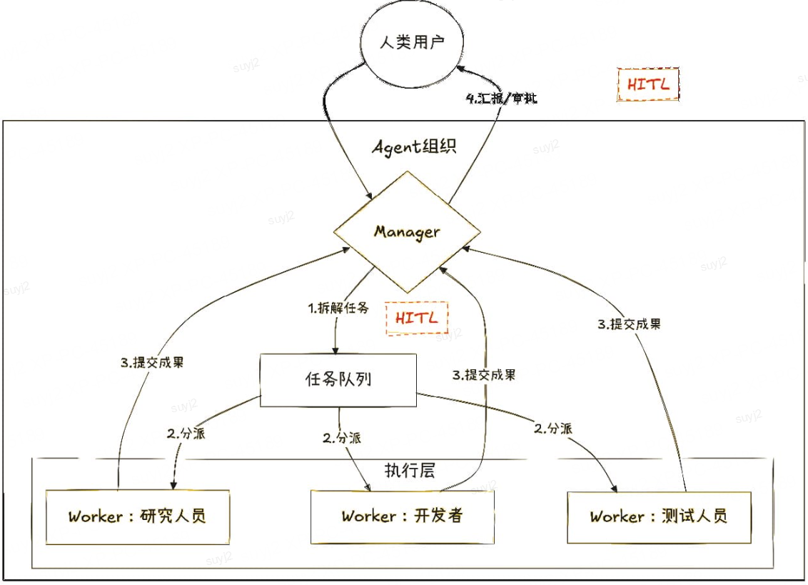

# 委托层级：倒树状指挥链的协同艺术

## 一句话结论

委托层级通过“全局Manager+局部Worker”的倒树状架构，将复杂任务递归分解为可执行的子任务，并利用Map-Reduce实现大规模并行处理，同时通过审批流构建人机安全边界，使一群“平凡”Agent组合成一支“天才”团队。

---

## Why：背景 / 痛点 / 目标 / 约束

### 背景与痛点

单体Agent面临三重根本性局限：

1. **认知负荷瓶颈**：GPT-4等大模型的上下文窗口虽已扩展至128K Token，但在处理“写一份完整财报”这类复杂任务时，仍然面临信息过载问题——模型难以在单一上下文中保持对所有章节逻辑一致性的全局把控。

2. **并行能力缺失**：单体Agent本质是串行处理器，无法同时利用多核资源。在需要处理100份财报数据提取的场景下，逐一处理的Token消耗是并行处理的10倍以上。

3. **安全边界模糊**：当Agent获得API调用权限后，理论上存在“暴走”风险——无限循环调用付费API、误删生产数据库等灾难性场景缺乏有效的自动中止机制。

### 目标指标

| 指标 | 目标值 | 说明 |
|------|--------|------|
| 任务复杂度支持 | 无限 | 通过递归分解支持任意深度任务 |
| 并行吞吐提升 | ≥10x | Map-Reduce模式下并行处理效率 |
| 安全中断响应 | <1s | 风险操作自动挂起延迟 |
| 人类介入节点 | 清晰定义 | 每个里程碑可人工确认 |

### 约束条件

- **上下文隔离**：Worker仅拥有局部上下文，无法访问全局敏感信息
- **通信开销**：层级调用带来额外Token消耗，适用于复杂度≥阈值的长任务
- **一致性挑战**：多Worker结果聚合需解决冲突与版本同步问题

---

## What：概念 / 边界 / 核心组成

### 核心定义




**委托层级（Delegation/Hierarchy）**：一种将复杂任务按“倒树状指挥链”拓扑结构进行层级分解与并行执行的Agent协作模式。系统包含拥有全局上下文的Manager节点和仅拥有局部上下文的Worker节点，通过递归分解、Map-Reduce和审批流三大机制协调工作。

### 关键术语

| 术语 | 定义 |
|------|------|
| Manager | 拥有全局上下文的调度节点，负责任务分解、结果聚合、流程控制 |
| Worker | 拥有局部上下文的执行节点，仅负责子任务的原子执行 |
| Sub-Manager | Worker在接收过于复杂的子任务时，临时升级为Manager继续分解 |
| 倒树状指挥链 | Manager在根节点，Worker在叶子节点的层级拓扑结构 |
| Map | 任务分发阶段，Manager将大任务拆分为子任务并分发给Worker |
| Reduce | 结果归约阶段，Manager汇总Worker结果并生成最终输出 |
| 审批流 | 人机安全边界机制，包括被动中断和主动中断两种模式 |

### 系统边界

- **输入**：结构化任务描述 + 可用Agent清单 + 安全策略配置
- **输出**：任务执行结果 + 执行日志 + 风险审计记录
- **适用范围**：复杂多步骤任务、大规模并行处理任务、需要人工审核的关键业务
- **不适用**：简单短任务（通信开销超过收益）、实时性要求极高的任务

### 核心组成

```
委托层级架构
├── Manager层（全局上下文）
│   ├── 任务分解器
│   ├── 结果聚合器
│   ├── 流程控制器
│   └── 安全审计器
├── Worker层（局部上下文）
│   ├── 原子执行器
│   └── 状态报告器
└── 审批流层
    ├── 被动中断（风险评分触发）
    └── 主动中断（里程碑触发）
```

---

## How：原理 → 流程 → 架构 → 选型 → 实现要点

### 1. 原理机制

委托层级的核心价值在于**能力的层级解耦**：

- **认知负荷分散**：将全局复杂性从单一Agent分散到多个层级Agent，每个节点只需处理局部最优
- **并行效率提升**：Map阶段并行处理，Reduce阶段串行聚合，实现“并联-串联”混合执行
- **安全边界内嵌**：审批流机制将人类监督嵌入执行流程，而非事后审计

### 2. 流程步骤

#### 流程一：递归分解

```
Step 1: Manager接收任务T
    ↓
Step 2: T是否可 atomic 执行？
    ├─ 是 → 分发给Worker执行
    └─ 否 → 分解为T1, T2, ..., Tn
          ↓
Step 3: 每个Ti分发给对应Worker
          ↓
Step 4: Worker接收Ti
          ↓
Step 5: Ti是否可 atomic 执行？
    ├─ 是 → 执行并返回结果
    └─ 否 → Worker升级为Sub-Manager，跳转Step 2
```

#### 流程二：Map-Reduce

```
Step 1 (Map): Manager将任务T拆分为{T1, T2, ..., Tn}
    ↓
Step 2: 并行分发给Worker 1~n
    ↓
Step 3: 各Worker独立执行并返回{R1, R2, ..., Rn}
    ↓
Step 4 (Reduce): Manager聚合{R1~Rn} → R_final
```

#### 流程三：审批流

```
执行中 → 风险评估 → 超阈值？
    ├─ 是 → 被动中断 → 挂起等待人工确认
    └─ 否 → 继续执行
    
里程碑 → 主动中断 → 等待人工确认？
    ├─ 是 → 暂停 → 人工确认后继续
    └─ 否 → 无需确认，继续执行
```

### 3. 架构设计

#### 倒树状指挥链拓扑

```
                    [Manager - 全局上下文]
                    /    |    \
                   /     |     \
           [Worker A] [Worker B] [Worker C]
           (局部上下文) (局部上下文) (局部上下文)
              /    \
         [Worker A1] [Worker A2]
         (局部上下文) (局部上下文)
```

#### 委托层级架构图

```
┌─────────────────────────────────────────────────────┐
│                   任务输入                           │
│              "写一份完整财报"                        │
└────────────────────┬────────────────────────────────┘
                     ↓
┌──────────────────────────────────────────────────────┐
│  Manager (全局上下文，256K)                         │
│  ┌────────────────────────────────────────────────┐ │
│  │ 任务分解器：递归分解为"第1章"..."第n章"          │ │
│  │ 结果聚合器：合并子任务结果为最终文档            │ │
│  │ 流程控制器：管理执行状态与里程碑                │ │
│  │ 安全审计器：评估风险评分，控制中断             │ │
│  └────────────────────────────────────────────────┘ │
└────────────────────┬────────────────────────────────┘
                     ↓
       ┌──────────────┼──────────────┐
       ↓              ↓              ↓
┌──────────┐  ┌──────────┐  ┌──────────┐
│Worker 1-3 │  │Worker 4-6 │  │Worker 7-10│
│(局部64K)  │  │(局部64K)  │  │(局部64K)  │
│并行处理   │  ��并行处理   │  │并行处理   │
└───────────┘  └───────────┘  └───────────┘
       └──────────────┼──────────────┘
                     ↓
┌──────────────────────────────────────────────────────┐
│  Reduce: Manager聚合结果，生成最终财报              │
│  审批流: 里程碑节点检查人类确认                      │
└──────────────────────────────────────────────────────┘
```

### 4. 技术选型

| 维度 | 方案A：层级Agent | 方案B：单一Agent | 方案C：提示词嵌套 |
|------|-------------------|-------------------|-------------------|
| **复杂度支持** | 无限递归 | 固定上下文 | 受限嵌套层数 |
| **并行效率** | 10x+ | 1x | 1x |
| **Token消耗** | 中（通信开销） | 低 | 高（prompt膨胀） |
| **一致性** | 需要聚合算法 | 自然保证 | 自然保证 |
| **安全性** | 高（审批流） | 低 | 中 |
| **适用场景** | 复杂长任务 | 简单短任务 | 中等复杂度 |

**选型依据**：当任务复杂度超过单体Agent上下文承载能力时，必须选用方案A。团队能力为辅助考量因素——拥有成熟的Agent框架团队可直接采用开源方案（如AutoGen、CrewAI）。

### 5. 实现要点

#### 要点一：上下文隔离策略

```python
class Manager:
    def __init__(self, global_context_window: int = 128000):
        self.global_context = Context(global_context_window)
        self.worker_context_window = 32000  # Worker仅局部上下文
    
    def create_worker(self, task_description: str) -> Worker:
        local_context = self.global_context.slice(
            relevant_info_for(task_description)
        )
        return Worker(local_context)
```

#### 要点二：递归分解算法

```python
def recursive_decompose(task: str, complexity_threshold: int) -> List[Task]:
    if estimate_complexity(task) <= complexity_threshold:
        return [Task(task, atomic=True)]
    
    subtasks = decompose(task)  # 基于语义的子任务拆分
    result = []
    for subtask in subtasks:
        result.extend(recursive_decompose(subtask, complexity_threshold))
    return result
```

#### 要点三：Map-Reduce聚合

```python
def map_reduce(tasks: List[Task], workers: List[Worker]) -> str:
    # Map: 并行分发
    results = parallel_execute(tasks, workers)
    
    # Reduce: 串行聚合
    combined = "\n".join(results)
    final_report = llm.aggregate(f"聚合以下内容:\n{combined}")
    return final_report
```

#### 要点四：审批流安全机制

```python
class ApprovalFlow:
    def __init__(self, risk_threshold: float = 0.7):
        self.risk_threshold = risk_threshold
    
    def check_operation(self, operation: Operation) -> bool:
        risk_score = self.assess_risk(operation)
        return risk_score <= self.risk_threshold
    
    def passive_interrupt(self, operation: Operation, human: Human):
        if not self.check_operation(operation):
            human.notify(f"风险操作需确认: {operation}")
            human.wait_confirmation()
    
    def active_interrupt(self, milestone: bool, human: Human):
        if milestone and not human.auto_continue:
            human.notify("里程碑达成，等待确认")
            human.wait_confirmation()
```

---

## 优化与改进方案（多层次、多方案、含收益与代价）

### 方案一：缓存优化——减少重复计算

| 维度 | 内容 |
|------|------|
| **收益** | 相同子任务重复执行率从30%降至5%以下 |
| **代价** | 额外存储开销约20%；缓存管理复杂度提升 |
| **适用条件** | 存在大量相似子任务的企业场景 |
| **验证方式** | A/B测试：记录缓存命中前后Token消耗对比 |

```python
class CachingManager(Manager):
    def execute(self, task: Task) -> str:
        cache_key = hash(task.description)
        if cache_key in self.cache:
            return self.cache[cache_key]
        
        result = super().execute(task)
        self.cache[cache_key] = result
        return result
```

### 方案二：自适应分解——动态调整粒度

| 维度 | 内容 |
|------|------|
| **收益** | 减少过度分解导致的通信开销，节省约15% Token |
| **代价** | 实现复杂度提升；需要历史数据分析能力 |
| **适用条件** | 任务模式可归纳的历史数据丰富场景 |
| **验证方式** | 对比固定分解与自适应分解的执行效率 |

```python
def adaptive_decompose(task: str, history_data: List[Task]) -> List[Task]:
    historical_complexity = analyze_history(task, history_data)
    threshold = calibrate_threshold(historical_complexity)
    return recursive_decompose(task, threshold)
```

### 方案三：多级审批——分层安全边界

| 维度 | 内容 |
|------|------|
| **收益** | 高风险操作强制人工介入；低风���操作自动通过 |
| **代价** | 配置复杂度提升；审批流程可能延长 |
| **适用条件** | 金融、医疗等强合规要求的业务场景 |
| **验证方式** | 审计日志统计：各风险等级操作的审批通过率与拦截率 |

```python
class MultiLevelApproval:
    def __init__(self):
        self.policies = {
            "low_risk": AutoApprove(),
            "medium_risk": TeamLeadApproval(),
            "high_risk": ManagerApproval(),
            "critical_risk": TwoPersonApproval()
        }
    
    def check(self, operation: Operation) -> bool:
        level = self.classify_risk(operation)
        return self.policies[level].approve(operation)
```

---

## 场景适配与优缺点 / 风险

### 适用场景

| 场景 | 适用性 | 核心机制 |
|------|--------|----------|
| 长文档生成（财报、方案书） | 强适用 | 递归分解 + 审批流 |
| 大规模数据分析 | 强适用 | Map-Reduce |
| 多系统API编排 | 适用 | 审批流 |
| 实时对话系统 | 不适用 | Token开销过高 |

### 优缺点

| 优点 | 说明 |
|------|------|
| 无限复杂度 | 递归分解理论上支持任意复杂度任务 |
| 并行高效 | Map-Reduce显著提升大规模任务吞吐 |
| 安全可控 | 审批流提供清晰的人机安全边界 |
| 角色清晰 | 人类介入节点明确，不干扰Agent执行 |

| 缺点 | 说明 |
|------|------|
| 通信开销 | 层级调用带来额外Token消耗 |
| 一致性挑战 | 多Worker输出需要额外聚合处理 |
| 调试困难 | 分布式执行链路的错误定位成本高 |
| 响应延迟 | 审批流中断带来等待时间 |

### 风险清单与缓解措施

| 风险类型 | 风险描述 | 缓解措施 |
|----------|----------|----------|
| **一致性** | 多Worker输出逻辑冲突 | 结果版本管理 + 冲突检测 |
| **通信失败** | Worker节点失联 | 心跳检测 + 超时重试 |
| **审批绕过** | Agent绕过审批流执行风险操作 | 操作日志全量审计 |
| **权限滥用** | Manager权限过大 | 最小权限原则 + 权限分级 |
| **递归爆炸** | 分解粒度过细导致执行爆炸 | 分解深度限制 + 复杂度监控 |

---

## 智能座舱 / 智能驾驶举例

### 场景：智能座舱的语音指令执行

**任务**：“帮我制定一个周末从上海到杭州的自驾游路线，要途径西湖景区，晚上8点前到达酒店休息。”

#### 倒树状指挥链执行

```
                    [Manager - 语音助手核心]
                    (全局上下文：用户偏好、行程约束、时间限制)
                    /    |    \
                   /     |     \
          [路径规划] [时间计算] [酒店推荐]
          Worker A   Worker B   Worker C
           ↓            ↓            ↓
        [地图API]   [交通API]   [酒店API]
        Worker A1   Worker B1   Worker C1
```

#### 执行流程

1. **Manager**：解析用户意图为3个子任务（路径规划、时间计算、酒店推荐）
2. **Map阶段**：并行调用3个Worker分别处理
3. **Reduce阶段**：聚合3路结果，生成完整行程方案
4. **审批流**：
   - 被动中断：若预计到达时间超过晚8点，自动提醒用户
   - 主动中断：方案生成后，等待用户确认“是否按此执行”

#### 架构映射

| 架构概念 | 智能座舱实现 |
|----------|--------------|
| 倒树状指挥链 | 语音助手 → 各API Worker |
| 递归分解 | 主意图 → 子任务 |
| Map-Reduce | 并行API调用 → 结果聚合 |
| 审批流 | 风险提醒 + 人工确认 |

---

## 面试官追问清单（含回答要点）

### Q1: 为什么不用单体Agent的CoT而要用委托层级？

**回答要点**：CoT在单一上下文中做推理，当任务复杂度超过模型上下文承载能力时会失效。委托层级通过递归分��将��杂度分散，每个子任务在单一Agent能力范围内。这是架构层面的scalability保障，而非prompt技巧。

### Q2: Map-Reduce和直接prompt嵌套有什么区别？

**回答要点**：直接prompt嵌套是“压缩打包”，将所有子任务说明放在一个prompt中，本质仍是单体Agent处理。Map-Reduce是“分布式计算”，子任务真正并行执行，结果独立返回后聚合。后者有明确的scalability上限（Worker数量），前者受限于单一模型的上下文窗口。

### Q3: 如何保证多Worker输出的一致性？

**回答要点**：三种手段——（1）输入Schema约束，子任务输出必须符合预定义结构；（2）冲突检测，Reduce阶段识别逻辑矛盾并标记；（3）版本管理，记录每次聚合的输入版本，支持回溯。建议引用“最终一致性”概念：允许中间状态暂时不一致，通过迭代收敛。

### Q4: 审批流的响应延迟怎么优化？

**回答要点**：两个方向——（1）分级审批，低风险操作自动通过，只拦截高风险操作；（2）异步确认，操作执行后异步通知人类，而非同步阻塞等待。关键是在安全性与效率之间找到平衡点。

### Q5: 委托层级适合实时性要求高的场景吗？

**回答要点**：不适合。委托层级的通信开销（调用延迟+审批等待）在秒级，不适合毫秒级响应的实时场景。实时场景更适合单体Agent+function calling，委托层级适合后台任务处理。

---

## 总结提纲（可背诵要点）

1. **倒树状架构**：Manager（全局上下文）+ Worker（局部上下文）的层级拓扑，实现认知负荷分散
2. **无限复杂度支持**：递归分解使系统理论上可处理任意复杂度任务
3. **并行突破**：Map-Reduce模式突破单体Agent的Token速率限制，实现10x+吞吐提升
4. **安全内嵌**：审批流机制（被动中断+主动中断）构建清晰的人机安全边界
5. **能力解耦**：生成能力（Worker执行）与调度能力（Manager分解）在架构层面分离
6. **适用场景**：复杂长任务、大规模并行处理、需要人工审核的关键业务
7. **不适用场景**：简单短任务、实时性要求极高的场景
8. **通信开销**：层级调用带来额外Token消耗，收益>开销时才选用
9. **一致性挑战**：需通过Schema约束、冲突检测、版本管理解决
10. **面试核心**：回答“为什么不用CoT”→“架构层面scalability” vs “prompt技巧”

---

## 需要搜索/核对的信息清单

- [ ] 各主流Agent框架（AutoGen、CrewAI、LangChain Agents）的委托层级实现方案对比
- [ ] Map-Reduce在Agent场景下的性能基准测试数据
- [ ] 大模型上下文窗口扩展的最新进展（200K→1M Token）对委托层级架构的影响