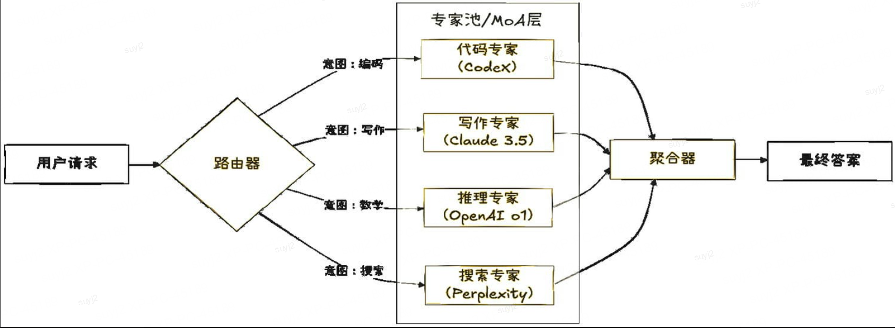

# 路由分发：智能分诊的演进艺术

## 一句话结论

路由模式从僵化的“关键词匹配”演进为“语义分发”再到“Agent混合聚合”，核心目标是以最低延迟与成本，将问题精准交由最合适的模型处理，实现异构模型生态的最优资源分配。

---

## Why：背景 / 痛点 / 目标 / 约束

### 背景与痛点

#### 1. 异构模型生态的资源错配

当前Agent系统面临模型选型困境：GPT-4能力强但成本高，Llama 3成本低但能力有限。若不加区分地使用单一模型，会导致：

- **成本浪费**：简单查询（如“今天天气如何”）使用GPT-4处理，Token成本是Llama 3的30倍以上
- **响应延迟**：复杂推理任务排队等待，而简单任务本可瞬间完成
- **能力错配**：简单模型处理不了复杂任务，复杂模型处理简单任务又显“杀鸡用牛刀”

#### 2. 传统规则路由的脆弱性

早期聊天机器人依赖正则表达式或关键词匹配：

```python
if "订单" in query:
    route_to(OrderAgent)
elif "天气" in query:
    route_to(WeatherAgent)
```

此类模式的问题：

- **表述泛化能力弱**：用户说“查一下我买的东西”无法触发“订单”规则
- **维护成本线性增长**：每增加一个意图类别，需新增对应规则
- **优先级冲突**：当多个规则匹配时，结果不可预测

#### 3. 单体模型的幻觉与能力上限

单体Agent的固有局限：

- **幻觉问题**：单一模型可能在关键细节上产生“自信的幻觉”
- **能力天花板**：无法突破训练数据的知识截止日期
- **风格单一**：输出风格受限于单一模型的训练数据分布

### 目标指标

| 指标 | 目标值 | 说明 |
|------|--------|------|
| 路由准确率 | ≥95% | 语义路由意图识别准确率 |
| 成本优化 | ≥50% | 相比纯GPT-4方案的成本降低 |
| 延迟增量 | <100ms | 路由决策引入的额外延迟 |
| 候选答案质量 | 优于单体模型 | 多模型聚合的评估分数提升 |

### 约束条件

- **嵌入模型依赖**：语义路由依赖高质量的嵌入模型
- **聚合复杂度**：Agent混合路由带来多模型调用与结果融合开销
- **模型可用性**：路由器需实时感知各模型的可用状态
- **隐私合规**：敏感查询跨模型分发需考虑数据安全

---

## What：概念 / 边界 / 核心组成



### 核心定义

**路由分发（Routing/Dispatch）**：一种将用户请求智能分发的Agent协作模式。路由器充当系统的“网关”或“前额叶”，根据请求特征（语义、复杂度、领域等）将请求分发至最合适的处理单元（专家Agent、专用模型、或执行管线）。

### 关键术语

| 术语 | 定义 |
|------|------|
| 规则路由 | 基于正则表达式或关键词匹配的确定性路由 |
| 语义路由 | 基于嵌入向量相似度计算的智能路由 |
| Agent混合路由 | 并行分发至多个异构模型，聚合生成最终答案 |
| 路由器 | 负责意图识别与请求分发的网关组件 |
| 专家Agent | 针对特定领域或任务优化的专用Agent |
| 能力描述 | 描述各专家Agent能力的嵌入向量或特征描述 |
| 聚合器 | 综合多模型输出，生成最终答案的第二层处理单元 |

### 系统边界

- **输入**：用户自然语言请求 + 可用模型/Agent清单 + 成本/延迟约束
- **输出**：分发决策 + 处理结果（或进一步流转至执行层）
- **适用范围**：异构模型生态、多领域覆盖、需要质量保障的关键任务
- **不适用场景**：单一模型足矣的简单场景、对延迟极度敏感的场景

### 核心组成

```
路由分发架构
├── 路由器层
│   ├── 意图识别器
│   ├── 路由决策器
│   └── 负载均衡器
├── 专家Agent池
│   ├── 领域专家（订单、天气、客服...）
│   ├── 能力专家（代码、写作、分析...）
│   └── 风格专家（简洁、详细、正式...）
└── 聚合层（如Agent混合路由）
    ├── 答案排序器
    └── 融合生成器
```

---

## How：原理 → 流程 → 架构 → 选型 → 实现要点

### 1. 原理机制

#### 核心价值：能力的解耦与最优分配

路由模式的本质是**关注点分离**：

- 路由器专注于“做什么”（任务分类、意图识别）
- 执行器专注于“怎么做”（任务执行、专业输出）
- 聚合器专注于“如何更好”（质量保障、多模型融合）

这种分离使各组件可独立优化、独立扩展。

#### 演化路径

```
┌─────────────────────────────────────────────────────────────┐
│                     路由模式演化路径                        │
├─────────────────────────────────────────────────────────────┤
│                                                             │
│   规则路由 ──→ 语义路由 ──→ Agent混合路由                   │
│   │              │              │                         │
│   │              │              │                         │
│   关键词匹配    嵌入向量+      并行多模型                  │
│   正则表达式    余弦相似度    聚合生成                     │
│                                                             │
│   成本：低      成本：中        成本：高                    │
│   准确率：中    准确率：高      准确率：很高                │
│   维护性：差    维护性：中      维护性：好                   │
│                                                             │
└─────────────────────────────────────────────────────────────┘
```

### 2. 流程步骤

#### 流程一：规则路由

```
Step 1: 接收用户查询
    ↓
Step 2: 按预定义规则顺序匹配
    ↓
Step 3: 找到首个匹配规则？
    ├─ 是 → 分发至对应处理单元
    └─ 否 → 默认处理 / 追问用户
```

#### 流程二：语义路由

```
Step 1: 接收用户查询
    ↓
Step 2: 将查询编码为嵌入向量 Q
    ↓
Step 3: 计算 Q 与各专家能力描述向量的余弦相似度
    ↓
Step 4: 选择相似度最高的Top-K专家
    ↓
Step 5: 分发至最合适的专家处理
```

#### 流程三：Agent混合路由

```
Step 1: 接收用户查询
    ↓
Step 2: 并行分发至多个异构模型（GPT-4、Claude、Llama）
    ↓
Step 3: 各模型独立生成候选答案 {A1, A2, A3}
    ↓
Step 4: 聚合器评估候选答案质量
    ↓
Step 5: 融合优点，生成最终答案 A_final
```

#### 流程四：路由+委托组合（智能分级响应）

```
Step 1: 路由器接收请求
    ↓
Step 2: 识别任务复杂度
    ├─ 简单任务 → 直接路由至Worker执行
    └─ 复杂任务 → 路由至Manager进入委托模式
          ↓
Step 3: Manager进行子任务分解
          ↓
Step 4: Map-Reduce执行子任务
          ↓
Step 5: 结果返回路由器，路由至用户
```

### 3. 架构设计

#### 语义路由架构图

```
┌──────────────���─��────────────────────────────────────────────┐
│                      用户查询                               │
│              "我的订单到哪了？"                             │
└────────────────────────────┬────────────────────────────────┘
                             ↓
┌─────────────────────────────────────────────────────────────┐
│   路由器 (前额叶)                                          │
│   ┌──────────────────────────────────────────────────────┐ │
│   │ 意图识别：这是"订单查询"意图                         │ │
│   │ 嵌入编码：query → [0.12, -0.34, 0.56, ...]          │ │
│   └──────────────────────────────────────────────────────┘ │
└────────────────────────────┬────────────────────────────────┘
                             ↓
       ┌────────────────────┼────────────────────┐
       ↓                    ↓                    ↓
┌─────────────┐    ┌─────────────┐    ┌─────────────┐
│ 订单Agent   │    │ 物流Agent   │    │ 客服Agent  │
│ (相似度0.9) │    │ (相似度0.7) │    │ (相似度0.3)│
└─────────────┘    └─────────────┘    └─────────────┘
       └────────────────────┬────────────────────┘
                            ↓
                 ┌─────────────────────────┐
                 │ 分发至最高相似度专家    │
                 │ 订单Agent处理          │
                 └─────────────────────────┘
```

#### Agent混合路由架构图

```
┌─────────────────────────────────────────────────────────────┐
│                      用户查询                               │
│              "解释量子计算的基本原理"                      │
└────────────────────────────┬────────────────────────────────┘
                             ↓
┌─────────────────────────────────────────────────────────────┐
│   第一层：并行生成                                          │
│   ┌───────────────┬───────────────┬───────────────┐              │
│   ↓             ↓             ↓                             │
│ ┌─────────┐  ┌─────────┐  ┌─────────────┐                   │
│ │GPT-4    │  │Claude 3 │  │Llama 3     │                   │
│ │深度推理│  │分析��考��  │快速摘要   │                   │
│ └─────────┘  └─────────┘  └─────────────┘                   │
│    A1          A2            A3                            │
└────────────────────────────┬────────────────────────────────┘
                             ↓
┌─────────────────────────────────────────────────────────────┐
│   第二层：聚合生成                                          │
│   ┌──────────────────────────────────────────────────────┐ │
│   │ 评估：A1(深度+) A2(逻辑+) A3(速度+)                     │ │
│   │ 融合：取A1的专业性 + A2的分析性 → A_final              │ │
│   └──────────────────────────────────────────────────────┘ │
└────────────────────────────┬──���─────────────────────────────┘
                             ↓
                 ┌─────────────────────────┐
                 │ 最终答案输出             │
                 │ (多模型优点融合)         │
                 └─────────────────────────┘
```

### 4. 技术选型

| 维度 | 规则路由 | 语义路由 | Agent混合路由 |
|------|---------|----------|---------------|
| **实现复杂度** | 低 | 中 | 高 |
| **路由准确率** | 依赖规则质量 | 依赖嵌入模型 | 多模型投票 |
| **延迟** | <10ms | <50ms | 取决于最慢模型 |
| **成本** | 极低 | 低 | 高（多模型调用） |
| **可维护性** | 差（规则爆炸） | 好 | 好 |
| **适用场景** | 意图明确的小系统 | 通用对话系统 | 关键任务质量保障 |

**选型依据**：简单问答场景优先语义路由，成本敏感场景优先规则路由，质量要求高的关键任务使用Agent混合路由。企业级系统推荐语义路由为主、Agent混合路由为备选的分级方案。

### 5. 实现要点

#### 要点一：语义路由的核心算法

```python
class SemanticRouter:
    def __init__(self, embedding_model: str = "text-embedding-3"):
        self.embedding_model = embedding_model
        self.experts = {}  # expert_name -> embedding
    
    def register_expert(self, name: str, capability_description: str):
        embedding = self.encode(capability_description)
        self.experts[name] = embedding
    
    def route(self, query: str, top_k: int = 1) -> List[Tuple[str, float]]:
        query_embedding = self.encode(query)
        scores = []
        for name, expert_embedding in self.experts.items():
            score = cosine_similarity(query_embedding, expert_embedding)
            scores.append((name, score))
        
        scores.sort(key=lambda x: x[1], reverse=True)
        return scores[:top_k]
```

#### 要点二：Agent混合路由的并行执行

```python
class AgentMixRouter:
    def __init__(self, models: List[LLM]):
        self.models = models
    
    async def route(self, query: str) -> str:
        # 第一层：并行生成
        tasks = [model.generate(query) for model in self.models]
        candidates = await asyncio.gather(*tasks)
        
        # 第二层：聚合生成
        aggregator_prompt = self.build_aggregation_prompt(query, candidates)
        final_answer = await self.aggregator.generate(aggregator_prompt)
        return final_answer
    
    def build_aggregation_prompt(self, query: str, candidates: List[str]) -> str:
        return f"""用户问题: {query}
        
各模型生成答案如下：
{model1}: {candidates[0]}
{model2}: {candidates[1]}
{model3}: {candidates[2]}

请综合各答案的优点，生成一个完整、准确的回答。
"""
```

#### 要点三：路由+委托组合的执行器

```python
class SmartRouter:
    def __init__(self, delegate_manager: Manager):
        self.delegate_manager = delegate_manager
        self.simple_experts = {}
    
    async def handle(self, request: str) -> str:
        complexity = self.estimate_complexity(request)
        
        if complexity < self.simple_threshold:
            # 简单任务：直接路由至专家Agent
            expert = self.route(request)
            return await expert.execute(request)
        else:
            # 复杂任务：路由至委托模式
            return await self.delegate_manager.handle(request)
    
    def estimate_complexity(self, request: str) -> float:
        # 基于请求特征估计复杂度
        prompt = f"""评估以下任务的复杂度（0-1）：
{request}
返回格式：复杂度评分"""
        return float(self.llm.generate(prompt))
```

---

## 优化与改进方案（多层次、多方案、含收益与代价）

### 方案一：缓存路由决策——减少重复计算

| 维度 | 内容 |
|------|------|
| **收益** | 相同/相似查询的路由决策直接从缓存返回，延迟降低90% |
| **代价** | 缓存存储开销；需处理缓存失效 |
| **适用条件** | 用户Query存在大量重复的企业客服场景 |
| **验证方式** | 对比缓存命中前后的平均响应延迟 |

```python
class CachedRouter:
    def __init__(self, base_router: Router):
        self.base_router = base_router
        self.cache = LRUCache(maxsize=10000)
    
    def route(self, query: str) -> str:
        cache_key = hash(query)
        if cache_key in self.cache:
            return self.cache[cache_key]
        
        result = self.base_router.route(query)
        self.cache[cache_key] = result
        return result
```

### 方案二：自适应模型选择——动态调整调用策略

| 维度 | 内容 |
|------|------|
| **收益** | 根据查询难度动态选择模型，避免过度使用昂贵模型，成本降低30-50% |
| **代价** | 难度评估器本身的准确度影响整体效果 |
| **适用条件** | 成本敏感的企业级部署 |
| **验证方式** | A/B测试：固定模型方案 vs 自适应方案的成本对比 |

```python
class AdaptiveRouter:
    def __init__(self):
        self.tier_models = {
            "tier1": gpt4,   # 高能力，高成本
            "tier2": claude3,  # 中能力，中成本
            "tier3": llama3   # 基础能力，低成本
        }
    
    def select_model(self, query: str) -> LLM:
        difficulty = self.assess_difficulty(query)
        
        if difficulty > 0.8:
            return self.tier_models["tier1"]
        elif difficulty > 0.5:
            return self.tier_models["tier2"]
        else:
            return self.tier_models["tier3"]
```

### 方案三：模型热备份——高可用保障

| 维度 | 内容 |
|------|------|
| **收益** | 主模型不可用时自动切换至备份模型，可用性提升至99.9% |
| **代价** | 备份模型的调用成本；状态管理复杂度 |
| **适用条件** | 生产环境对可用性有严格要求 |
| **验证方式** | 模拟主模型故障，验证自动切换时间与结果正确性 |

```python
class HotBackupRouter:
    def __init__(self, primary: LLM, backup: LLM):
        self.primary = primary
        self.backup = backup
    
    async def generate(self, prompt: str) -> str:
        try:
            return await self.primary.generate(prompt)
        except ModelUnavailableError:
            return await self.backup.generate(prompt)
```

---

## 场景适配与优缺点 / 风险

### 适用场景

| 场景 | 适用性 | 核心机制 |
|------|--------|----------|
| 企业客服系统 | 强适用 | 语义路由+多专家Agent |
| 多模型API聚合 | 强适用 | Agent混合路由 |
| 智能分级响应 | 强适用 | 路由+委托组合 |
| 实时对话系统 | 适用 | 规则路由+缓存 |
| 低延迟要求场景 | 不适用 | 路由决策引入额外延迟 |

### 优缺点

| 优点 | 说明 |
|------|------|
| 成本优化 | 按需分配计算资源，避免过度使用昂贵模型 |
| 能力解耦 | 路由器与执行器独立扩展 |
| 质量保障 | Agent混合路由通过多模型聚合降低幻觉风险 |
| 灵活扩展 | 新增专家Agent只需注册能力描述 |
| 可维护性好 | 语义路由无需维护大量if-else规则 |

| 缺点 | 说明 |
|------|------|
| 延迟增加 | 路由决策带来额外延迟（<100ms） |
| 实现复杂度 | Agent混合路由需处理多模型并发与聚合 |
| 依赖嵌入模型 | 语义路由依赖高质量嵌入模型 |
| 一致性挑战 | 多模型输出风格可能不一致 |
| 成���叠��� | Agent混合路由成本为多模型之和 |

### 风险清单与缓解措施

| 风险类型 | 风险描述 | 缓解措施 |
|----------|----------|----------|
| **路由失误** | 意图识别错误导致分发至错误专家 | 多路分发兜底 + 人工反馈优化 |
| **模型不可用** | 主模型服务中断 | 热备份自动切换 |
| **聚合冲突** | 多模型输出逻辑矛盾 | 冲突检测 + 优先级裁决 |
| **缓存穿透** | 恶意查询绕过缓存 | 限流 + 异常检测 |
| **隐私泄露** | 敏感Query跨模型分发 | 数据脱敏 + 权限控制 |

---

## 智能座舱 / 智能驾驶举例

### 场景：智能座舱的语音指令分诊

**任务**：处理驾驶员的各种语音指令“我困了”、“帮我找个加油站”、“打开音乐”、“导航到最近的餐厅”

#### 路由分发执行

```
                    [语音输入]
                    "我困了"
                     ↓
┌─────────────────────────────────────────────────┐
│  语义路由器 (前额叶)                             │
│  编码 → 嵌入向量 → 计算相似度                    │
│  驾驶Agent(0.92) > 音乐Agent(0.15) > 导航Agent(0.08)│
└────────────────────────────┬────────────────────────────────┘
                           ↓
                 ┌─────────────────────┐
                 │ 路由至驾驶Agent    │
                 │ "检测到疲劳意图"  │
                 └─────────────────────┘
                           ↓
┌─────────────────────────────────────────────────┐
│  驾驶Agent执行                                │
│  建议：打开座椅按摩/播放提神音乐/导航至服务区│
└─────────────────────────────────────────────────┘
```

#### 路由+委托组合

```
                    [复杂任务]
                    "帮我规划一个从上海到成都的自驾游路线，途经西安"
                     ↓
┌─────────────────────────────────────────────────┐
│  路由器识别：这是一个复杂的旅行规划任务         │
│  复杂度评估：高                           │
└────────────────────────────┬────────────────────────────────┘
                           ↓
          ┌────────────────┴────────────────┐
          ↓ (路由至委托模式)               ↓
┌──────────────────────────────────────┐
│  Manager (委托层级)                    │
│  分解：路线规划、景点推荐、酒店安排    │
│  Map: 并行调用各API                  │
│  Reduce: 聚合为完整旅行计划          │
└──────────────────────────────────────┘
```

#### 架构映射

| 架构概念 | 智能座舱实现 |
|----------|--------------|
| 路由器 | 语音意图识别模块 |
| 语义路由 | 意图嵌入向量匹配 |
| Agent混合路由 | 多语音助手结果融合 |
| 路由+委托组合 | 简单指令直发、复杂任务进入委托流程 |

---

## 面试官追问清单（含回答要点）

### Q1: 语义路由和关键词匹配的本质区别是什么？

**回答要点**：关键词匹配是“字面匹配”，依赖字面重叠；语义路由是“向量匹配”，依赖语义空间距离。前者维护成本线性增长，后者可自动泛化新意图。本质区别是规则系统 vs 机器学习系统。

### Q2: Agent混合路由的成本怎么控制？

**回答要点**：三种手段——（1）分级使用，只有关键任务才启用多模型聚合；（2）提前终止，当某一模型输出明显优于其他时提前结束；（3）模型轮换，避免固定调用某一昂贵模型。核心是在质量与成本之间找平衡。

### Q3: 路由器的准确性怎么评估？

**回答要点**：两个维度——（1）路由准确率，分发正确的占比；（2）任务完成率，用户意图被正确满足的占比。前者看路由决策，后者看端到端效果。实际评估需结合业务指标。

### Q4: 路由模式适合实时对话吗？

**回答要点**：语义路由延迟约50-100ms，对语音对话（预期延迟<500ms）可接受。但对极低延迟场景（如实时游戏操作），建议用规则路由或预训练指令缓存。关键是场景匹配。

### Q5: 如何处理多模型输出的冲突？

**回答要点**：三种手段——（1）投票机制，按多数意见选择；（2）置信度排序，按各模型历史准确率加权；（3）冲突标记，当冲突无法融合时输出“我不确定”。推荐置信度排序+冲突标记的组合。

---

## 总结提纲（可背诵要点）

1. **网关角色**：路由器充当系统“前额叶”，负责意图识别与请求分发
2. **演化路径**：规则路由 → 语义路由 → Agent混合路由
3. **语义路由核心**：嵌入向量 + 余弦相似度，实现模糊匹配与泛化
4. **Agent混合路由**：并行多模型生成 + 聚合融合，突破单体模型能力上限
5. **组合价值**：路由+委托组合实现智能分级响应，简单任务直发、复杂任务进入委托
6. **成本优化**：按需分配计算资源，避免“杀鸡用牛刀”
7. **延迟控制**：语义路由<100ms，Agent混合路由取决于最慢模型
8. **适用场景**：企业客服、多模型聚合、复杂任务处理
9. **不适用场景**：单一模型足矣的简单场景、极度延迟敏感场景
10. **面试核心**：回答“语义路由 vs 关键词匹配”→“机器学习 vs 规则系统”

---

## 需要搜索/核对的信息清单

- [ ] 各主流嵌入模型（text-embedding-3、bge、M3E）的性能对比数据
- [ ] Agent混合路由在生产环境中的成本基准测试
- [ ] 多模型输出聚合的最新研究进展（2024-2025）